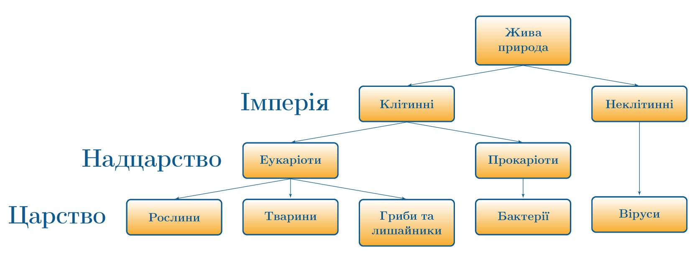

Царства живого.
===============

Усю живу природу можна поділити на дві імперії: Клітинні та Неклітинні.
Як уже згадувалося вище, тільки віруси не мають клітинної будови та
проявляють процеси життєдіяльності виключно в клітинах інших організмів.

Імперія Клітинні включає надцарства Еукаріоти (Ядерні) та Прокаріоти
(Доядерні). До еукаріотів належать ті організми, в більшості клітин яких
наявні ядра. Ядро – це органела, яка регулює процеси життєдіяльності в
клітині, та в якій зберігається спадкова інформація. До Еукаріотів
належать три царства живого: Рослини, Тварини та Гриби та лишайники.

У Доядерних організмів ядро відсутнє, а спадкова інформація зберігається
у вигляді великої молекули ДНК, яку називають нуклеоїдом. До Прокаріотів належить царство Бактерії.

http://youtu.be/ir4phST2pMs

<quiz correctLabel="correct" incorrectLabel="incorrect" checkLabel="check">
    <question text="">
        
Кішка належить до царства:

        <answer>Неклітинні</answer>
        <answer>Еукаріоти</answer>
        <answer>Рослини та тварини</answer>
        <answer correct>Тварини</answer>
        <explanation>
        Неклітинні – це не царство, а імперія. Царство Рослини та царство Тварини – це два окремих царства. Еукаріоти – це не царство, а надцарство.
        </explanation>
    </question>
</quiz>
