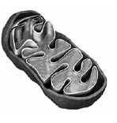

# Клiтина та тканини рослин
# Рослинна клiтина

Означення

<b>Клiтина</b> — основна структурно-функцiональна одиниця живого.

Клiтина мiстить органели та включення. Органели – це постiйнi
структурно-функцiональнi компоненти клiтини. Включення – це непостiйнi компоненти клiтини. Типовi включення у рослиннiй клiтинi – це
кристали щавлевокислого кальцiю (кальцiй оксалату).
Усi органели (постiйнi функцiональнi компоненти клiтини) знаходяться у цитоплазмi.

Означення

<b>Цитоплазма</b> — це внутрiшнє середовище клiтини.

Цитоплазма постiйно рухається. Цей рух називається циклозом.
Якщо вiн припиняється, клiтина помирає. У цитоплазмi вiдбуваються
деякi реакцiї, необхiднi для життєдiяльностi клiтини.
Клiтина оточена **плазматичною мембраною** (плазмалемою), а в
рослинної клiтини наявний надмембранний комплекс – клiтинна стiнка з **целюлози**. У клiтиннiй стiнцi є пори, через якi проходять цитоплазматичнi мiсточки – **плазмодесми**.
Плазмалема, цитоплазма та ядро становлять живий вмiст рослинної клiтини – **протопласт**. Плазмодесмами протопласти рiзних клiтин
об’єднуються в єдину систему. Система протопластiв називається **симпласт**, а система клiтинних стiнок – **апопласт**.
У клiтинi рослини також мiстяться включення – непостiйнi компоненти. До включень належать, наприклад, пiгменти або кристали
щавлевокислого кальцiю (кальцiй оксалату).

| Двомембраннi | Одномембраннi | Немембраннi |
| -- | -- | -- |
|**Ядро** – округла органела, яка керує усіма процесами життєдіяльності клітини та в якій зберігається спадкова інформація. У двомембранній оболонці ядра наявні ядерні пори, через які відбувається транспорт речовин у ядро та з нього. Всередині ядра знаходиться хроматин (розкручені хромосоми) та ядерце – структура, у якій відбувається синтез субодиниць рибосом.|**Ендоплазматична сітка** (ЕПС; ендоплазматичний ретикулум) – органела, яка становить єдине ціле із зовнішньою оболонкою ядра. На поверхні ЕПС синтезуються органічні речовини. ЕПС може бути зернистою (гранулярною) та незернистою (агранулярною). На зернистій ЕПС розташовані рибосоми, а отже, на ній відбувається синтез білка. Не гладенькій ЕПС синтезуються жири та вуглеводи. | **Рибосома** – органела, субодиниці якої синтезуються в ядерці. За участі рибосоми здійснюється синтез білка. Рибосома складається з двох субодиниць – великої та малої. Рибосоми розташовані в клітині або на поверхні гранулярної ЕПС, або вільно в цитоплазмі.|
|**Мітохондрія** – органела, в якій відбувається клітинне дихання, «енергетична станція» клітини. В мітохондрії в результаті дихання синтезуються молекули АТФ – джерело енергії клітини. |**Апарат Гольджі** – органела, яка побудована з плоских мембранних мішечків. В апараті Гольджі зберігаються та з нього транспортуються органічні речовини. | |
|**Пластиди** – органели, характерні для рослин. Органела зеленого кольору (через великий вміст хлорофілу), у якій відбувається фотосинтез – це хлоропласт. Існують також хромопласти, які містять різні пігменти(червоні, помаранчеві, жовті) та впливають на забарвлення клітини, та лейкопласти – безбарвні пластиди, у яких запасаються поживні речовини. |**Вакуоля** – найбільша органела в рослинній клітині. Зовні вакуоля оточена мембраною – тонопластом, а всередині органели міститься розчин солей, органічних речовин, продуктів життєдіяльності клітини, пігментів. Вакуоля регулює тургорний тиск (всередині рослинної клітини, який збільшується, коли до клітини потрапляє вода та всі органели притискуються до клітинної стінки), надає червоного, синього або пурпурного забарвлення плодам, брунькам і квіткам завдяки пігментам антоціанам.| ||

На малюнку чiтко видно клiтинну стiнку з порами, яка оточує клiтину.

Лiва верхня частина – хроматин (розкрученi хромосоми) всерединi
ядра. Зовнiшня оболонка ядра поступово переходить в ендоплазматичну сiтку (зафарбована темно-сiрим кольором).

Ядерна пора в ядернiй оболонцi.

Гранулярна ЕПС, на якiй позначено рибосоми.

Рибосома.

Комплекс Гольджi.

Мiтохондрiя. На малюнку чiтко видно зовнiшню мембрану та внутрiшню, яка утворює складки кристи.

Хлоропласт.

Особливостi, характернi саме для рослинної клiтини:
* Наявнiсть клiтинної стiнки з целюлози
* Наявнiсть пластид
* Наявнiсть великої вакуолi, заповненої клiтинним соком
* Накопичення крохмалю.

