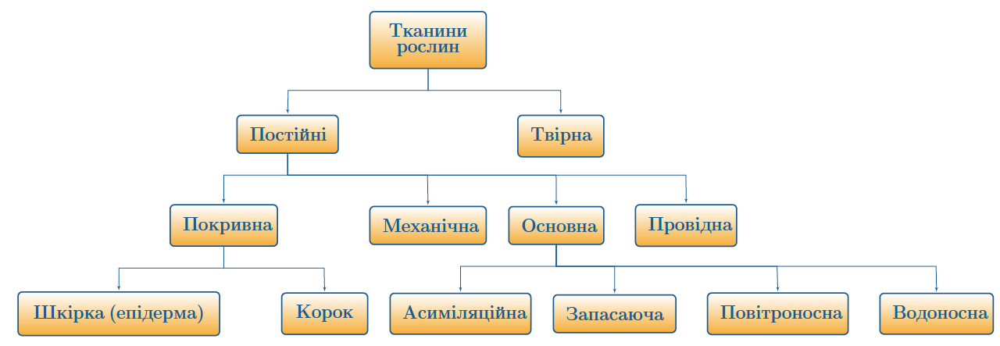

# Рослиннi тканини

Означення

<b>Тканина</b> — це група клiтин, якi мають спiльне походження та функцiї та подiбну будову.

Вiдповiдно до будови, рослини подiляють на вищi та нижчi.

Означення

<b>Нижчi рослини</b> — це тi рослини, якi не мають тканин, тiло яких
не подiлено (не диференцiйовано) на органи. До нижчих рослин належать водоростi. 
<b>Вищi рослини</b> — це тi рослини, в яких з’являються тканини, органи. До вищих рослин належать наземнi рослини.

Тканини рослин подiляються на постiйнi та твiрну(меристему). Твiрна тканина(меристема) побудована з клiтин з великими ядрами та тонкими стiнками. Це клiтини, якi постiйно дiляться. Твiрна тканина дає
початок усiм iншим тканинам та забезпечує регенерацiю рослин. Вона
розташована на верхiвках кореня, пагона або всерединi цих органiв.

Табл. 1: Постійні тканини

<table>
<tr>
    <th>Назва тканини</th>
    <th>Функції</th>
</tr>
    <th class="center">Покривна</th>
    <th class="left">Основна функція покривної тканини полягає у захисті рослини від несприятливих впливів навколишнього середовища: висихань, коливань температури, механічних ушкоджень тощо. Клітини покривних тканин щільно прилягають одна до одної для того, щоб краще забезпечити захист рослини від зовнішніх впливів. Виділяють три типи покривних тканин (до цього згадувалося лише 2): 
    <b>Шкірка<b/>(епідерма) – первинна покривна тканина, яка побудована з живих клітин. Шкірка вкриває листки та має продихи. 
    <b>Корок</b> – вторинна покривна тканина, яка формується на поверхнях дворічних стебел. 
    <b>Кірка</b> – вторинна покривна тканина, яка формується замість корку. Побудована з мертвих клітин.</th>
  <tr>
    <td class="center">Основна (паренхіма)</td>
    <td class="left">Основна тканина займає більшу частину рослинного організму. Виділяють такі основні тканини: 
    <b>Асиміляційна</b>(фото-синтезуюча) побудована з клітин, які містять велику кількість хлоропластів. Ця тканина розташована в листках та зелених стеблах, у ній відбувається фотосинтез; 
    <b>Запасаюча тканина не містить хлоропластів</b>, у ній відкладаються такі поживні речовини, як крохмаль, олії, цукор тощо. Запасаюча тканина розташована у серцевині стебел, насінні, бульбах, цибулинах, плодах тощо. 
    <bПовітроносна тканина</b> (аеренхіма) має заповнені повітрям міжклітинники, завдяки яким відбувається газообмін. Аеренхіма наявна у болотних і водних рослин. 
    <b>Водоносна тканина побудована з клітин</b>, які містять велику кількість води. Така тканина наявна в рослин посушливих місцевостей.</td>
  </tr>
  <tr>
    <td class="center">Механічна</td>
    <td class="left">Механічна тканина надає рослинам пружності та міцності. Існує два види механічної тканини: коленхіма та склеренхіма. Коленхіма побудована із живих клітин, а склеренхіма – із мертвих.</td>
  </tr>
  <tr>
    <td class="center">Провідна</td>
    <td class="left">По провідних тканинах відбувається висхідний (від кореня до стебла, листків) та низхідний (від листків до кореня) рух речовин. Розрізняють такі провідні тканини: 
    <b>Ксилема</b> (деревина) побудована із мертвих клітин, які утворюють судин и(трахеї та трахеїди). По ній неорганічні речовини рухаються вгору (висхідний рух). 
    <b>Флоема</b> (луб) побудована із живих клітин, які утворюють ситоподібні трубки. По флоемі органічні речовини, утворені під час фотосинтезу, транспортуються від листків до кореня.</td>
  </tr>
</table>