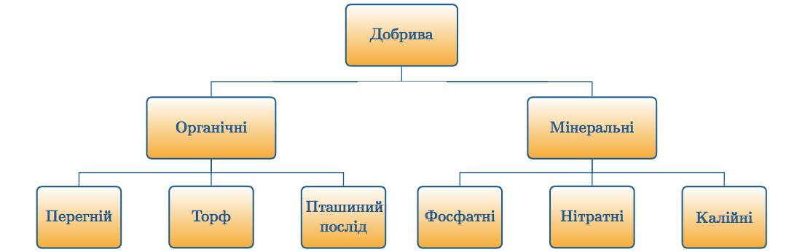

# Добрива

Добрива сприяють кращому мiнеральному живленню рослин та запобiгають виснаженню ґрунту.

Добрива можуть бути *органiчними* та *мiнеральними*. До органiчних добрив вiдносять перегнiй, торф та пташиний послiд. До неорганiчних добрив вiдносять:

* **фосфатнi** – пришвидшують рiст i розвиток рослин, достигання плодiв;
* **нiтратнi** – пiдвищують врожайнiсть та вегетативну масу рослин;
* **калiйні** – пiдвищують холодота посухостiйкiсть рослин, посилюють розвиток коренiв.

