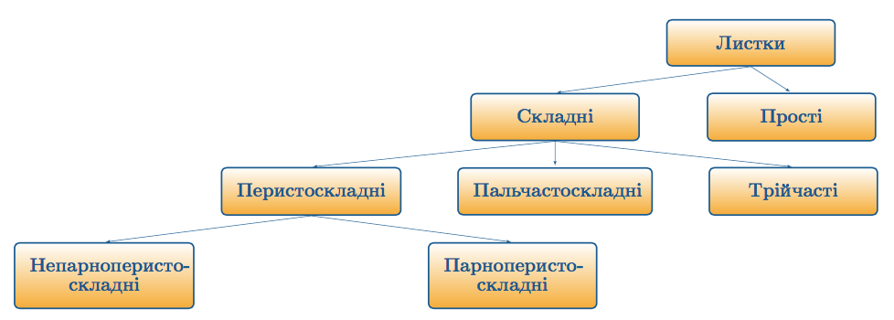
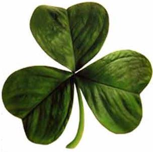
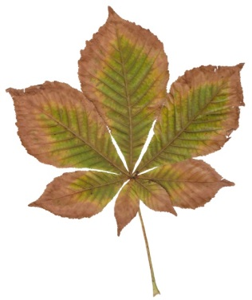
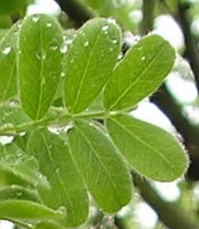
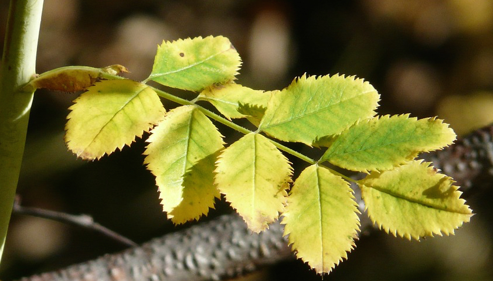

# Класифiкацiя листкiв

Залежно вiд зовнiшньої будови, розрiзняють складнi та простi листки.

Визначення

<b>Простi листки</b> — це листки, в яких на одному черешку розташовується лише одна листкова пластинка, навiть глибоко розсiчена. 
<b>Складнi листки</b> — це листки, в яких на одному черешку наявнi кiлька пластинок.

Основнi типи складних листкiв

| Листок | Представник | Зображення |
| -- | -- | -- |
| Трiйчастий | Конюшина | |
| Пальчастоскладний | Гiркокаштан, люпин |  |
| Парноперистоскладний |Горох, жовта акацiя |  |
| Непарноперистоскладний | Троянда, бiла акацiя |  |

<iframe align="center" width="560" height="315" src="https://www.youtube.com/embed/HPTWTbMXcIM" frameborder="0" allowfullscreen></iframe>

<quiz>
<question text="">
    
В гіркокаштану листки:

    <answer>прості</answer>
    <answer>трійчасті</answer>
    <answer correct>пальчасті</answer>
    <answer>перистоскладні</answer>
</question>
<question>
    
У конюшини листки:

    <answer correct>трійчасті</answer>
    <answer>перистоскладні</answer>
    <answer>пальчасті</answer>
    <answer>прості</answer>
</question>
</quiz>
