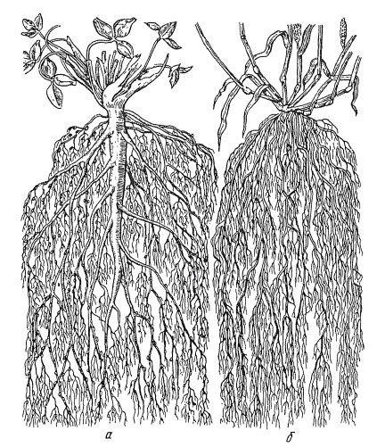

# Кореневi системи
Усi коренi рослини об’єднуються в **кореневi системи**.

Розрiзняють два види кореневих систем:

<ul>
<li>а) – стрижнева коренева система;</li> 
<li>б) – мичкувата.</li>
</ul>

| Стрижнева коренева система | Мичкувата коренева система |
| -- | -- |
| Головний корiнь значно вирiзня- ється за товщиною та довжиною серед iнших коренiв. Така корене- ва система властива дводольним рослинам. | Головний корiнь не вирiзняється серед бiчних або вiдмирає. Така коренева система властива одно- дольним рослинам. |
