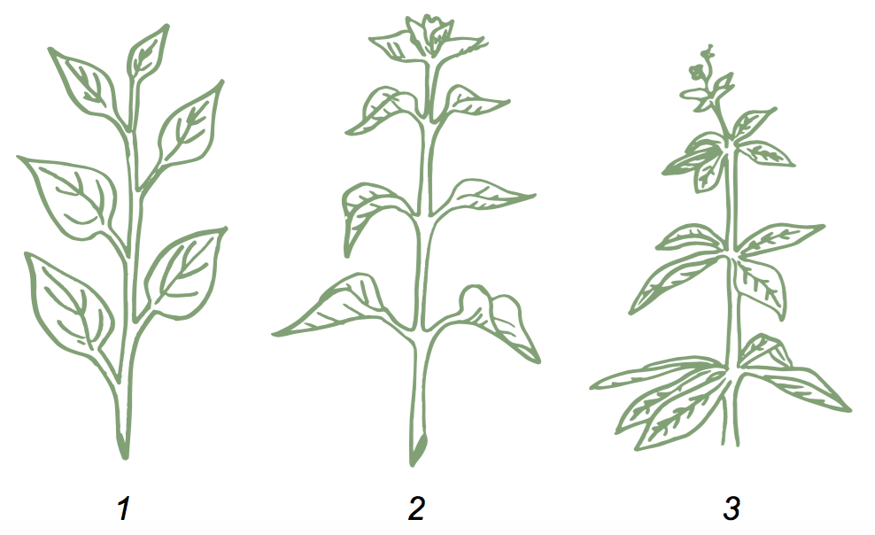

# Листкорозмiщення

Означення

<b>Листкорозмiщення</b> — це порядок розташування листкiв на стеблi.

| Тип листкорозмiщення | Почергове (спiральне) | Супротивне | Кiльчасте (мутовчасте) |
| -- | -- | -- | -- |
| | У кожному вузлi наявний лише один листочок, а всi разом їх можна з’єднати спiральною лiнiєю | В кожному вузлi розташовуються два листки таким чином, що листки iз сусiднiх вузлiв не затiнюють один одного. | В одному вузлi розташовуються бiльш, нiж два листки |
| Представники | Яблуня, береза, пшениця, верба | М’ята, бузок, клен, гвоздика | Хвощi, елодея, олеандр, вороняче око|
| Зображення | №1 на малюнку | №2 на малюнку | №3 на малюнку |

<iframe align="center" width="560" height="315" src="https://www.youtube.com/embed/aybNaPMWi3s" frameborder="0" allowfullscreen></iframe>

<quiz>
<question text="">
    
Розташування листкiв по три i бiльше у вузлi називається

    <answer>спiральним</answer>
    <answer correct>мутовчастим</answer>
    <answer>почерговим</answer>
    <answer>супротивним</answer>
    <explanation>
    При почерговому (спiральному) листкорозмiщеннi у кожному вузлi наявний лише один листочок, а всi разом їх можна з’єднати спiральною лiнiєю, при супротивному – в кожному вузлi розташовуються два листки таким чином, що листки iз сусiднiх вузлiв не затiнюють один одного, а при кiльчастому(мутовчастому) – в одному вузлi розташовуються бiльш, нiж два листки.
    </explanation>
</question>
</quiz>

   