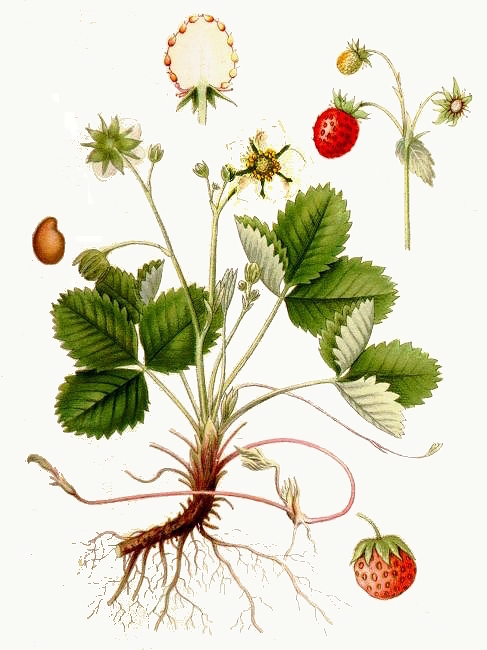
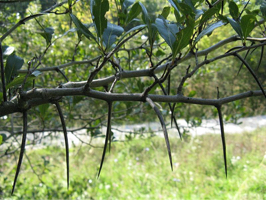
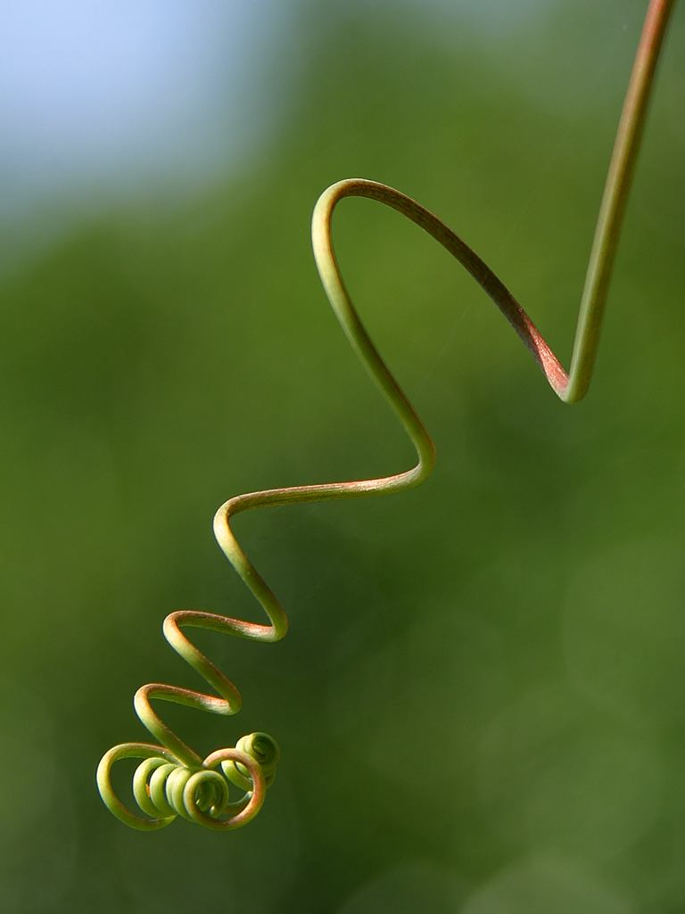

# Видозмiни
## Надземнi видозмiни

<table>
<thead>
<tr>
<th>Назва видозмiни</th>
<th>Будова та функцiі</th>
<th>Представник</th>
<th>Зображення</th>
</tr>
</thead>
<tbody>
<tr>
<td width="10%"><b>Вуса</b></td>
<td width="40%">Тонкi довгi пагони, за допомогою яких вiдбувається розмноження</td>
<td>Суниця, полуниця, перстач гусячии</td>
<td width="30%"></td>
</tr>
<tr>
<td><b>Колючки</b></td>
<td>Короткi пагони, якi запобiгають надмiрному випаровуванню та поїданню тваринам</td>
<td>Дика груша, терн, глід</td>
<td></td>
</tr>
<tr>
<td><b>Вусики</b></td>
<td>Тонкi довгi пагони, за допомогою яких рослини крiпляться до опори</td>
<td>Виноград, огiрок.</td>
<td></td>
</tr>
</tbody>
</table>



<iframe align="center" width="560" height="315" src="https://www.youtube.com/embed/zFfWjlXxYhc" frameborder="0" allowfullscreen></iframe>




