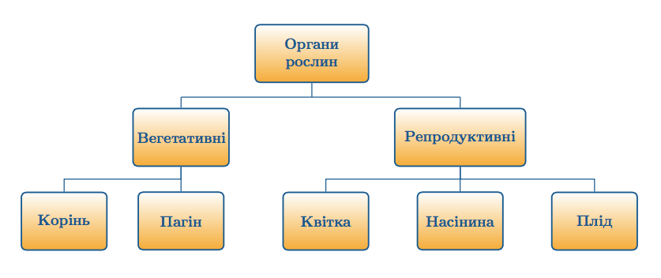

# Органи рослин

Визначення

<b>Орган</b> — це частина органiзму, яка має певне <i>розташування</i>, 
<i>будову</i> та виконує певнi <i>функцiі</i>. Органи та тканини наявнi лише у вищих рослин.

Вегетативнi органи

До вегетативних органів вiдносять корiнь та пагiн. Це органи, якi виконують основнi життєво важливi функцiї, тобто забезпечують дихання, живлення, фотосинтез, транспiрацiю, транспорт тощо. В процесi еволюцiї вегетативнi органи виникли ранiше за репродуктивнi.

Репродуктивнi (генеративнi) органи

До репродуктивних органів вiдносять квiтку, насiнину та плiд. Цi органи виконують функцiї розмноження, формування, захисту, розвитку та розповсюдження зачаткiв.

<iframe align="center" width="560" height="315" src="https://www.youtube.com/embed/NRBuLuNPNU4" frameborder="0" allowfullscreen></iframe>

<quiz correctLabel="correct" incorrectLabel="incorrect" checkLabel="check"> 
    <question text="">
        
Співвіднесіть функції органів рослин із загальною класифікацією: 
        Вегетативні органи

        <answer correct>фотосинтез, транспірація, дихання, транспорт речовин, механічна функція</answer>
        <answer>розмноження, формування, захист і розповсюдження зачатків.</answer>
    </question>
    <question text="">
        
Репродуктивні органи

        <answer>фотосинтез, транспірація, дихання, транспорт речовин, механічна функція</answer>
        <answer correct>розмноження, формування, захист і розповсюдження зачатків.</answer>
    </question>
</quiz>
