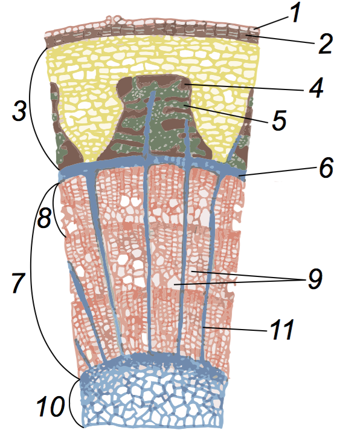

# Пагiн: стебло

Означення

<b>Стебло</b> — це вiсь пагона, яка несе на собi бруньки та листки. 

До функцiй стебла вiдносять:
* опорну (стебло несе на собi iншi органи рослини);
* транспортну (по стеблу вiдбувається транспорт речовин) ; 
* фотосинтез (молодi зеленi стебла фотосинтезують).

Внутрiшня будова стебла:

Всерединi стебло має визначену структуру:

* Зовнi воно оточено покривною тканиною – шаром шкiрки – 1 та
шаром корку – 2. Вона виконує захисну функцiю.
* Пiд корком розташована кора – 3, утворена основною та провiдною тканинами. В нiй мiстяться зерна крохмалю та кристали щавлево-кислого кальцiю. В корi також розташований луб (флоема). Луб не однорiдний, вiн складається з твердого та м’якого лубу. Твердий луб – 4 утворений мiцними волокнами, а м’який луб – 5 мiстить провiднi тканини – ситоподiбнi трубки та клiтини-супутницi. По флоемi вiдбувається транспорт органiчних речовин вiд листкiв до кореня, тобто вниз.
* Пiд лубом знаходиться шар камбiю – 6 – твiрної тканини, яка зумовлює бiчний рiст. При дiленнi камбiю, клiтини вiдкладаються назовнi та всередину, внаслiдок чого рослина потовщується. Камбiй функцiонує перiодично, вiд весни та до зими. Взимку камбiй не дiлиться. Внаслiдок такої перiодичностi утворюються рiчнi кiльця – неоднорiднi шари деревини.
* За камбiєм розташована деревина (ксилема; – 7). Деревина складається з рiчних кiлець. Деревина (ксилема) товща за кору, тому що пiд час дiлення камбiю (який не функцiонує тiльки взимку) бiльше клiтин вiдкладається всередину стебла, тобто формується нове рiчне кiльце – 8. Ксилема побудована з механiчних та провiдних тканин (у нiй наявнi судини – 9, по яких вода та мiнеральнi речовини транспортуються вiд кореня вгору).
* Глибше за деревину розташована серцевина – 10. У нiй зазвичай вiдкладаються поживнi речовини.
* Стебло пронизане горизонтальними серцевинними променями – 11, якi забезпечують транспорт речовин у горизонтальному напрямку.

<iframe align="center" width="560" height="315" src="https://www.youtube.com/embed/XRaYYU2-qzM" frameborder="0" allowfullscreen></iframe>

 

<quiz correctLabel="correct" incorrectLabel="incorrect" checkLabel="check"> 
    <question text="">
        
У 5-річній гілці яблуні:

        <answer>Одне річне кільце</answer>
        <answer correct>5 річних кілець</answer>
        <answer>10 річних кілець</answer>
        <answer>25 річних кілець</answer>
    <explanation>
    Скільки років існує гілка, стільки в неї і річних кілець. Річні кільця формуються внаслідок щорічного функціонування камбію.
    </explanation>
    </question>
</quiz>
   
