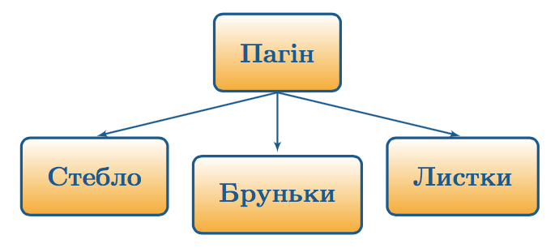
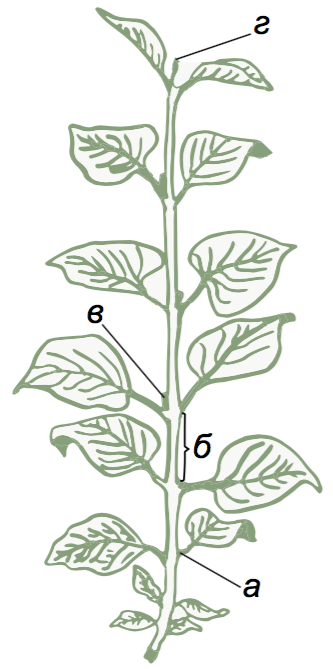

# Пагiн: загальна характеристика

Означення

<b>Пагiн</b> — надземний вегетативний орган рослин, який складається зi стебла, бруньок i листкiв.

Пагiн виник у рослин, як пристосування до життя в наземно-повiтряному
середовищi.

Означення

<b>Стебло</b> – це вiсь усього пагона.

На стеблi тримаються листки та бруньки.

Означення

<b>Листки</b> — бiчнi частини пагона, якi здiйснюють фотосинтез i транспiрацiю (випаровування).

Листки прикрiплюються до стебла у **вузлах** (а), вiдстань мiж сусiднiми вузлами називається **мiжвузлям** (б). Уявний кут, який наявний мiж стеблом i листком, називається **листковою пазухою**.

Мiжвузля iнколи можуть бути видовженими або вкороченими. 

Наприклад

Укороченi пагони яблунi та грушi навiть мають окрему назву. Їх називають <b>плодушками</b>, тому що на них формуються квiтки та плоди. Пiд час обрiзування дерев плодушки зберiгають. З iншого боку, на пагонах iнколи утворюються новi пагони з дуже видовженими мiжвузлями. Такi пагонивовчки – негайно видаляють.

На верхiвцi пагона та в пазухах знаходяться бруньки, вiдповiдно, верхiвковi (г) та пазушнi (в).
Якщо в рослини кiлька пагонiв, то той, який утворився з насiнини, називається головним.

Означення

<b>Брунька</b> – це власне зачатковий пагiн. 

До загальних **функцiй** пагона належать:
* Опорна (утримання на собi усiх надземних органiв рослин);
* Транспортна;
* Запасаюча;
* Здiйснення фотосинтезу (листки та молодi зеленi стебла фотосинтезують);
* Вегетативне розмноження.