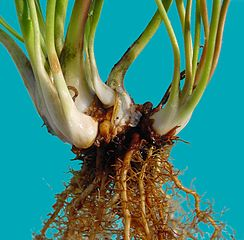
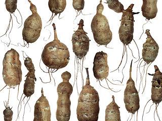
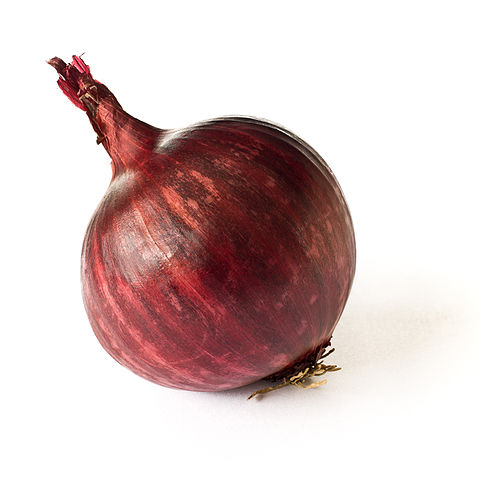
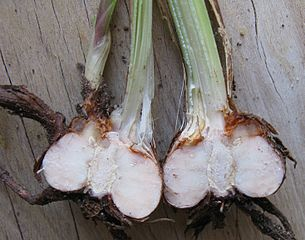

## Пiдземнi видозмiни

Функції підземних видозмін:
* запасання поживних речовин; 
* вегетативне розмноження.

Ці функції наявні у всіх представників.

| Назва видозмiни | Будова | Зображення |
| -- | --- | --- |
| **Кореневище** (в пирiю, конвалiї, пiвникiв i валерiани) | Схоже на корiнь, але замiсть кореневого чохлика має верхiвкову бруньку. На кореневищi наявнi луски – зачатковi листки |  |
| **Бульба** (в картоплi та топiнамбурi) | Товстий, м’ясистий пагiн iз редукованими листочками, у пазухах яких наявнi брунькии | |
|**Цибулина** (в цибулi, часнику, тюльпана, лiлiї)| Вкорочений пагiн, у якого наявнi i стебло (денце), i листочки (захиснi сухi луски, а пiд ними – м’ясистi луски). | |
|**Бульбоцибулина** (в шафрану)|Вкорочений пагiн, у якому наявнi стебло (денце), i листки – захиснi луски. Поживнi речовини вiдкладаються в денцi.| |


<iframe align="center" width="560" height="315" src="https://www.youtube.com/embed/p2HRBJSuhcs" frameborder="0" allowfullscreen></iframe>




<quiz>
<question text="">
    
Бульби стеблового походження наявні в:

    <answer correct>картоплі</answer>
    <answer>петрушки</answer>
    <answer>моркви</answer>
    <answer>буряка</answer>
    <explanation>
    Бульби стеблового походження наявні в картоплі та топінамбуру, а в моркви, петрушки та буряка наявні бульби кореневого походження.
    </explanation>
</question>
</quiz>
