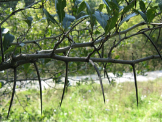
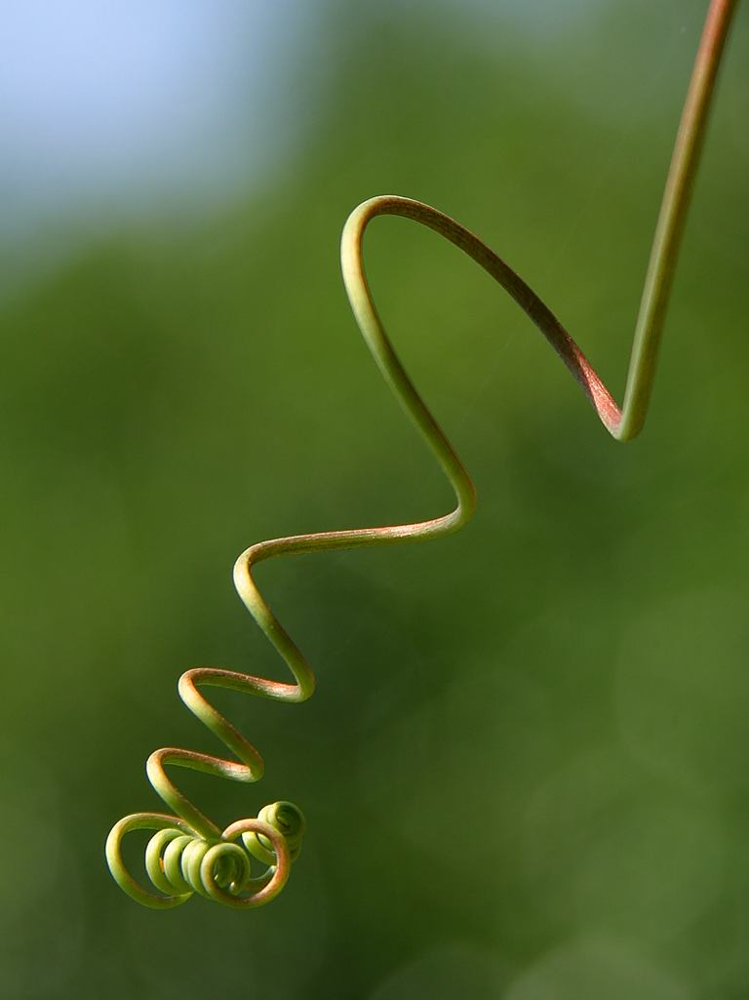

## Пiдземнi видозмiни

Функції підземних видозмін:
* запасання поживних речовин; 
* вегетативне розмноження.

| Назва видозмiни | Будова | Зображення |
| -- | --- | --- |
| **Кореневище** (в пирiю, конвалiї, пiвникiв i валерiани) | Схоже на корiнь, але замiсть кореневого чохлика має верхiвкову бруньку. На кореневищi наявнi луски – зачатковi листки |  |
| **Бульба** (в картоплi та топiнамбурi) | Товстий, м’ясистий пагiн iз редукованими листочками, у пазухах яких наявнi брунькии | |
|**Цибулина** (в цибулi, часнику, тюльпана, лiлiї)| Вкорочений пагiн, у якого наявнi i стебло (денце), i листочки (захиснi сухi луски, а пiд ними – м’ясистi луски). | |
|**Бульбоцибулина** (в шафрану)|Вкорочений пагiн, у якому наявнi стебло (денце), i листки – захиснi луски. Поживнi речовини вiдкладаються в денцi.| |

