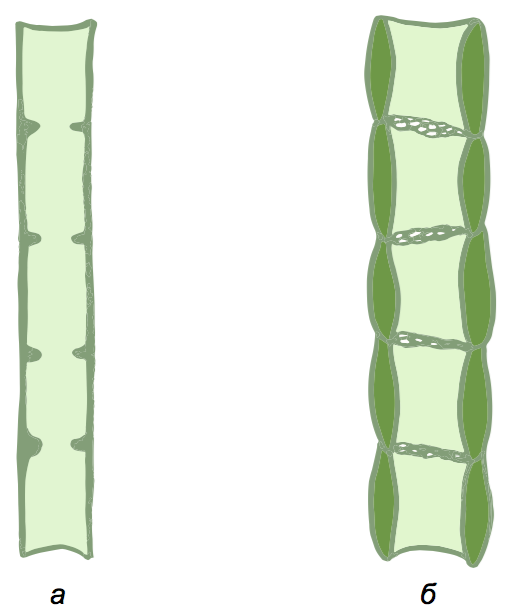

Транспорт речовин
-----------------

Транспорт відбувається по висхідній та низхідній течіях.

|Течія| Висхідна | Низхідна |
| -- | ---- | ---- |
| **Речовини, які транспортуються** | Мінеральні речовини та вода, інколи органічні речовини, що відкладалися у підземних органах | Органічні речовини, синтезовані в листках і стеблі |
| **Характеристика різновиду провідної тканини** | Деревина (ксилема -- рис. а) утворена **судинами** – трубочками з **мертвих** клітин, стінки між якими розчинилися. | Луб (флоема -- рис. б) утворений **ситоподібними трубками** – вертикальними рядами живих клітин. В деяких рослин функціонують клітини-супутниці, які виконують допоміжну функцію.|

<iframe align="center" width="560" height="315" src="https://www.youtube.com/embed/wo1bhTwvLV0" frameborder="0" allowfullscreen></iframe>

<quiz correctLabel="correct" incorrectLabel="incorrect" checkLabel="check"> 
    <question multiple>
        
Виберiть ознаки судин рослин:

        <answer>живi клiтини;</answer>
        <answer correct>мертвi клiтини;</answer>
        <answer correct>входять до складу ксилеми;</answer>
        <answer>входять до складу флоеми;</answer>
        <answer>забезпечують низхiдний потiк речовини;</answer>
        <answer correct>забезпечують висхiдний потiк речовини;</answer>
    <explanation>
    По ситоподiбних трубках флоеми, утворених живими клiтинами, органiчнi речовини транспортуються вниз, а по судинах ксилеми, утворених мертвими клiтинами, мiнеральнi солi та вода транспортуються вгору.
    </explanation>
    </question>
</quiz>