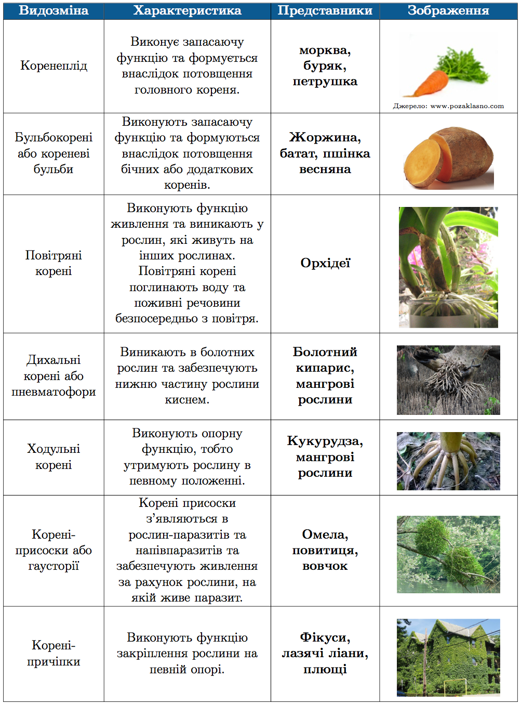
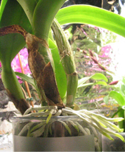
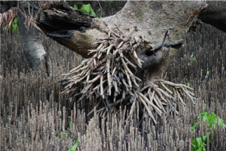
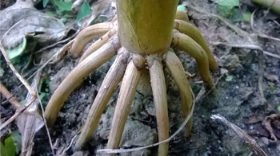
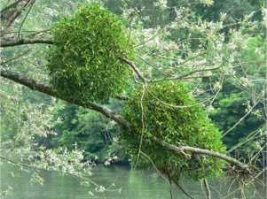
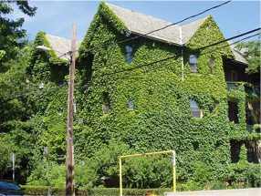

# Видозмiни кореня

| Видозмiна | Характеристика | Представники | Зображення |
| -- | --- | -- | --- |
| Коренеплід | Виконує запасаючу функцiю та формується внаслiдок потовщення головного кореня. | **морква, буряк, петрушка** |  |
| Бульбокоренi або кореневi бульби | Виконують запасаючу функцiю та формуються внаслiдок потовщення бiчних або додаткових коренiв. | **Жоржина, батат, пшiнка весняна** |  |
| Повiтрянi коренi | Виконують функцiю живлення та виникають у рослин, якi живуть на iнших рослинах. Повiтрянi коренi поглинають воду та поживнi речовини безпосередньо з повiтря. | **Орхiдеі** | |
| Дихальнi коренi або пневматофори | Виникають в болотних рослин та забезпечують нижню частину рослини киснем. | **Болотний кипарис, мангровi рослини** | |
| Ходульнi коренi | Виконують опорну функцiю, тобто утримують рослину в певному положеннi. | **Кукурудза, мангровi рослини** | |
| Коренi-присоски або гаусторiї | Коренi присоски з’являються в рослин-паразитiв та напiвпаразитiв та забезпечують живлення за рахунок рослини, на якiй живе паразит. | **Омела, повитиця, вовчок** | |
| Коренi-причiпки | Виконують функцiю закрiплення рослини на певнiй опорi. | **Фiкуси, лазячi лiани, плющi** | |
