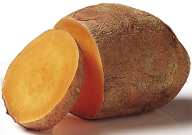

# Видозмiни кореня

| Коренеплід | Виконує запасаючу функцiю та формується внаслiдок потовщення головного кореня. | **морква, буряк, петрушка** |  |
| -- | -- | -- | -- |
| 0:2 | 1:2 | 2:2 |  |
| 0:3 | 1:3 | 2:3 | 3:3 |
| 0:4 | 1:4 | 2:4 | 3:4 |

](pic6_new.jpg)](1.jpg)](pic9_0.jpg)](pic8_0.jpg)