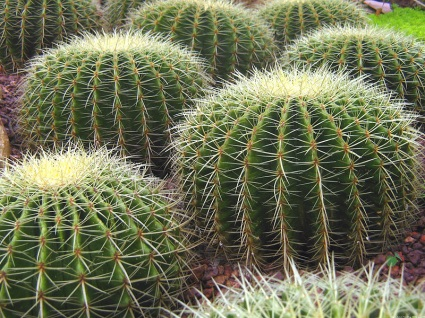
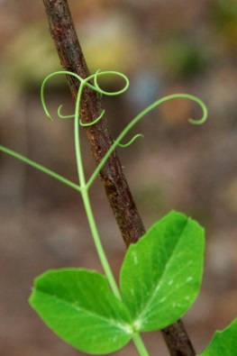
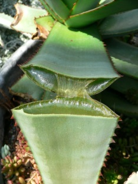
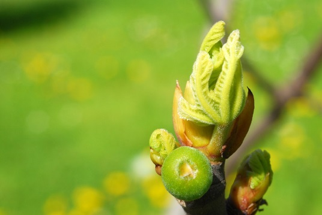
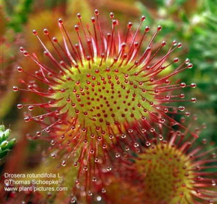

# Видозмiни листка

<table>
<thead>
<tr>
<th>Видозмiна</th>
<th>Характеристика</th>
<th>Представники</th>
<th>Зображення</th>
</tr>
</thead>
<tr>
<td>Колючки</td>
<td width="25%">Запобiгають надмiрному випаровуванню та поїданню тваринами рослини</td>
<td>Кактуси, молочаї, барбари</td>
<td width="30%"></td>
</tr>
<tr>
<td>Вусики</td>
<td>Виконують опорну функцiю</td>
<td>Горох, чина, вика, горошок</td>
<td></td>
</tr>
<tr>
<td>Водозапасаючi листки</td>
<td>М’ясистi, значно потовщенi листки, у яких запасається вода </td>
<td>Очиток, алое</td>
<td></td>
</tr>
<tr>
<td>Покривнi луски</td>
<td>Виконують захисну функцiю</td>
<td>На бульбах, кореневищi, цибулинах – видозмiнах пагона</td> <td></td>
<tr>
<td>Ловильнi апарати</td>
<td>Листок видiляє спецiальнi липкi секрети. Комахи прилипають та перетравлюються рослиною, забезпечуючи її азотистими сполуками.</td>
<td>Росичка</td>
<td></td>
</tr>
</tbody>
</table>

<iframe align="center" width="560" height="315" src="https://www.youtube.com/embed/gXHszpQa_6s" frameborder="0" allowfullscreen></iframe>

<quiz>
<question text="">
    
Видозмінені листки – це:

    <answer>колючки глоду</answer>
    <answer>вусики винограду</answer>
    <answer correct>колючки кактусів</answer>
    <answer>вуса суниці</answer>
    <explanation>
    Колючки глоду, вусики винограду, вуса суниці – видозміни пагонового походження, а колючки кактусів – видозміна саме листків.
    </explanation>
</question>
</quiz>

   