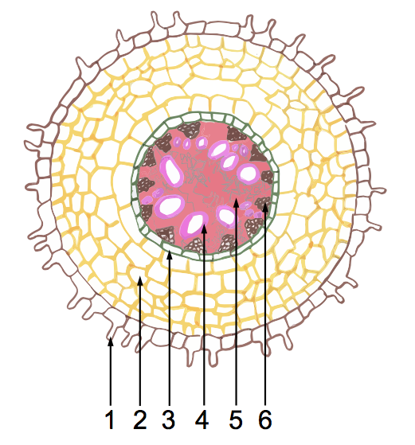
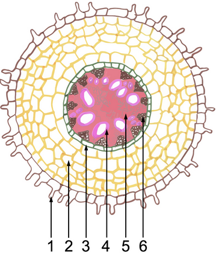

# Внутрiшня будова кореня у всиснiй зонi

Зовнi розташований шар клiтин покривної тканини(епiблеми), який дає початок одноклiтинним виростам – кореневим волоскам. Шар епiблеми позначений пiд №1.
Через кореневi волоски мiнеральнi речовини та вода надходять до первинної кори, побудованої з основної тканини, а потiм потрапляють до центрального цилiндру. Первинна кора (№2) здiйснює ряд функцiй, зокрема захисну, запасаючу, синтезу речовин та газообмiну.

Вона складається iз трьох послiдовно розмiщених шарiв: екзодерми, мезодерми та ендодерми. Екзодерма розташовується безпосередньо пiд епiблемою та зазвичай побудована з окорковiлих клiтин. Мезодерма розташована глибше та вiдрiзняється вiд iнших шарiв великими мiжклiтинниками. Основнi функцiї мезодерми – газообмiн, запасання та синтез органiчних речовин. Ендодерма – це один ряд клiтин, що оточує центральний цилiндр (стелу). Зовнiшнiй шар центрального цилiндру – перицикл (№3) – дає початок бiчним кореням. Всерединi центрального цилiндру (№5) знаходяться транспортна та механiчна тканини. Транспортна тканина представлена судинами (№4), з яких формується ксилема, та ситоподiбними трубками (№6), з яких формується флоема. По судинах вгору транспортуються неорганiчнi речовини, тобто вода та мiнеральнi сполуки, а по ситоподiбних трубках вниз транспортуються органiчнi речовини, що утворюються в результатi фотосинтезу.

<iframe align="center" width="560" height="315" src="https://www.youtube.com/embed/5i0nVLI7fPU" frameborder="0" allowfullscreen></iframe>

Встановіть відповідність між номером структури на малюнку та її функцією.

<quiz correctLabel="correct" incorrectLabel="incorrect" checkLabel="check">
    <question text="">
        
1

        <answer>транспорт води з мінеральними речовинами вгору</answer>
        <answer correct>всмоктування води з мінеральними речовинами</answer>
        <answer>транспорт органічних речовин вниз</answer>
        <answer>утворення бічних коренів</answer>
    </question>
    <question text="">
        
3

        <answer>транспорт води з мінеральними речовинами вгору</answer>
        <answer>всмоктування води з мінеральними речовинами</answer>
        <answer>транспорт органічних речовин вниз</answer>
        <answer correct>утворення бічних коренів</answer>
    </question>

<quiz correctLabel="correct" incorrectLabel="incorrect" checkLabel="check">
    <question text="">
        
4

        <answer correct>транспорт води з мінеральними речовинами вгору</answer>
        <answer>всмоктування води з мінеральними речовинами</answer>
        <answer>транспорт органічних речовин вниз</answer>
        <answer>утворення бічних коренів</answer>
    </question>
</quiz>

<quiz correctLabel="correct" incorrectLabel="incorrect" checkLabel="check">
    <question text="">
        
6

        <answer>транспорт води з мінеральними речовинами вгору</answer>
        <answer>всмоктування води з мінеральними речовинами</answer>
        <answer correct>транспорт органічних речовин вниз</answer>
        <answer>утворення бічних коренів</answer>
    </question>
</quiz>