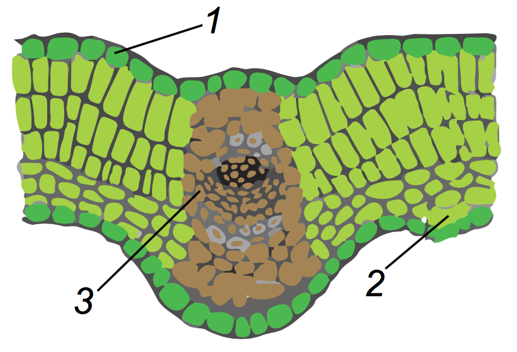

# Внутрiшня будова листка

**№1** Зверху та знизу листок вкритий тонким шаром безбарвної покривної тканини – шкiрки (або епiдерми) Зазвичай на шкiрцi наявний шар кутикули, утвореної з кутину (жироподiбної речовини), яка захищає листок вiд коливань температури, проникнення шкiдникiв або збудникiв iнфекцiй. В епiдермi наявнi продихи – це структури, якi побудованi з двох бобоподiбних клiтин, що мiстять багато хлоропластiв i можуть змiнювати свою форму. Змiнюючи форму, клiтини розширюють або звужують продихову щiлину. Продихи забезпечують процеси газообмiну та транспiрацiї.

**№2** Пiд епiдермою розташований мезофiл, тобто м’якуш листка. Вiн утворений основною тканиною – паренхiмою. Зверху основна тканина стовпчаста. ЇЇ клiтини щiльно прилягають одна до одної. Вони багатi на хлоропласти, а отже, в них активно вiдбувається фотосинтез. Знизу паренхiма губчаста. Мiж клiтинами цiєї тканини наявнi великi мiжклiтинники. Тут також вiдбувається фотосинтез, але не так iнтенсивно, як у стовпчастiй паренхiмi.
**№3** У листку наявна жилка. Волокна знаходяться внизу жилки та виконують опорну функцiю. Над ними знаходяться ситоподiбнi трубки, а над ситоподiбними трубками – судини.

<iframe align="center" width="560" height="315" src="https://www.youtube.com/embed/Gcp1M6q-Xv0" frameborder="0" allowfullscreen></iframe>

 
<quiz>
<question text="">
    
Фотосинтез найактивніше відбувається у:

    <answer correct>стовпчастій паренхімі</answer>
    <answer>продихах</answer>
    <answer>ксилемі</answer>
    <answer>паренхімі</answer>
    <explanation>
    Фотосинтез відбувається у стовпчастій та губчастій паренхімі, однак найактивніше цей процес протікає саме у стовпчастій основній тканині.
    </explanation>
</question>
<question>

    
На рисунку зображено поперечний розрiз листка. Яка функцiя структури, позначеної буквою Х?

    <answer>газообмiн</answer>
    <answer>транспiрацiя</answer>
    <answer correct>транспорт речовин</answer>
    <answer>фотосинтез</answer>
    <explanation>
    На малюнку позначено компонент жилки – судини, якi виконують транспортну функцiю.
    </explanation>
</quiz>