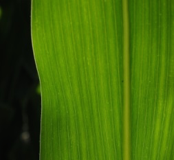
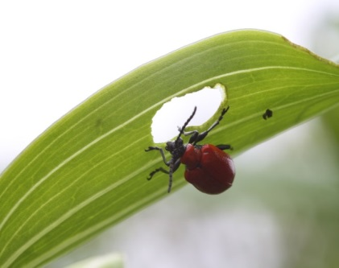
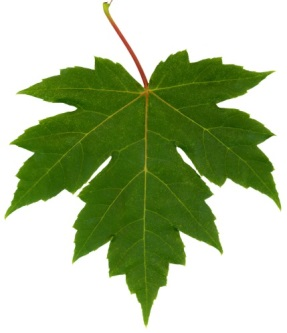
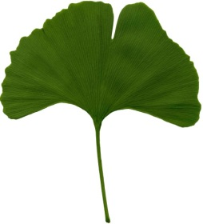

# Жилкування

Означення

<b>Жилкування</b> — це порядок розташування жилок на листковiй пластинцi.

| Тип жилкування | Паралельне | Дугове | Сiтчасте | Дихотомiчне |
| -- | -- | -- | -- | -- |
| Характеристика | Жилки розташованi паралельно вздовж листкової пластинки  | Жилки розташовуються вздовж пластинки дугоподiбно | Вiд однiєї (центральної) жилки вiдгалужуються iншi | Жилки на листку роздвоюються |
| Представники | злаковi рослини | конвалiя, тюльпан, подорожник | дуб, клен, яблуня, кропива | гiнкго дволопа- теве |
| Зображення |  |  |  |  |

