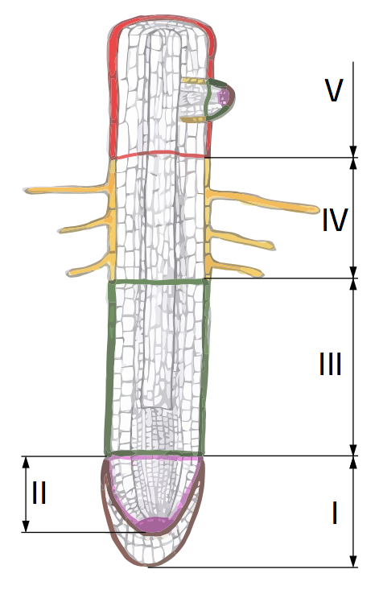

# Зони кореня
У будовi кореня видiляють кiлька зон, розглядаючи його знизу вгору:

**I. Кореневий чохлик** – утворення, яке вкриває зону поділу, захищає її вiд механiчних впливiв i сприяє просуванню кореня вглиб субстрату. Клiтини кореневого чохлика регулярно злущуються та замiнюються на новi.

**II. Зона подiлу** – вкрита кореневим чохликом. Ця дiлянка побудована з клiтин твiрної тканини, якi постiйно дiляться та забезпечують верхiвковий рiст кореня. Довжина зони подiлу становить 1-3 мм.

**III. Зона розтягування** побудована з клiтин, якi вже не дiляться, а набувають постiйної форми, розтягуються. Таким чином корiнь росте в довжину. Разом iз
зоною подiлу утворює *зону росту*.

**IV. Всисна зона** (зона всмоктування, зона кореневих волоскiв). На цiй дiлянцi клiтини покривної тканини (епiблеми) утворюють одноклiтиннi вирости – кореневi волоски. Вони збiльшують поглинальну поверхню кореня та всмоктують воду з розчиненими в нiй мiнеральними речовинами. Довжина цiєї зони становить близько 1,5-2см. Кореневi волоски живуть в середньому 10-20 дiб, а потiм вiдмирають i злущуються. Зона всмоктування постiйно перемiщується, адже корiнь росте i всi його дiлянки просуваються вглиб субстрату.

**V. Провiдна зона** (зона бiчних коренiв) – найдовша зона кореня. На цiй дiлянцi з’являються бiчнi коренi, якi закрiплюють рослину в грунтi. Також у провiднiй зонi з’являються транспортна та механiчна тканини.

<iframe align="center" width="560" height="315" src="https://www.youtube.com/embed/RhmzWMf0TDQ" frameborder="0" allowfullscreen></iframe>

<quiz correctLabel="correct" incorrectLabel="incorrect" checkLabel="check">
    <question text="">
        
Завдяки якій структурі вода та мінеральні речовини, розчинені в ній, потрапляють у корінь?

        <answer>осьовий циліндр</answer>
        <answer correct>кореневий волосок</answer>
        <answer>бічний корінь</answer>
        <answer>коренева шийка</answer>
        <explanation>
        Кореневі волоски всмоктують воду та мінеральні речовини. Осьовий циліндр містить транспортну та механічну тканини, коренева шийка – місце переходу кореня в пагін, а бічний корінь закріплює рослину в грунті.
        </explanation>
    </question>
    <question text="">
        
Зона кореня, що вкриває зону поділу та виконує захисну функцію – це

        <answer>всисна зона</answer>
        <answer>зона кореневих волосків</answer>
        <answer correct>кореневий чохлик</answer>
        <answer>захисна зона</answer>
        <explanation>
        Всисна зона та зона кореневих волосків – це одна й та сама ділянка кореня, яка виконує функцію всмоктування води з розчиненими у ній неорганічними речовинами; захисної зони не існує.
        </explanation>
    </question>
    <question text="">
        
Бічні корені формуються у зоні

        <answer>кореневих волосків</answer>
        <answer correct>провідній зоні</answer>
        <answer>зоні поділу</answer>
        <answer>зоні розтягування</answer>
        <explanation>
        Формування бічних коренів відбувається у провідній зоні (зоні бічних коренів), у зоні кореневих волосків відповідно формуються кореневі волоски, а не бічні корені; зони поділу та розтягування забезпечують ріст кореня.
        </explanation>
    </question>
</quiz>