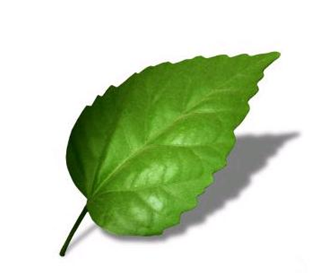

# Зовнiшня будова листка

Листок складається з листкової пластинки, до основних функцiй якої належать фотосинтез, газообмiн i транспiрацiя, та основи – мiсця, в якому листок приєднується до стебла. Мiж листковою пластинкою та основою може бути черешок, як на малюнку. Черешок регулює положення листка у просторi. Якщо черешка немає, такий листок називається сидячим. Сидячi листки наявнi, наприклад, в гвоздики, кукурудзи та пшеницi.

У листках наявнi жилки – пучки судин i волокон, якi виступають на листковiй пластинцi та виконують транспортну та опорну функцiї.

Iнколи бiля основи листка наявнi прилистки – невеликi бiчнi вирости. Вони виконують рiзнi функцiї у рiзних рослин. Наприклад, у бобових прилистки великi та беруть участь у фотосинтезi й транспiрацiї, а в бiлої акацiї – колючi, та виконують захисну функцiю.

Узагальнити зовнiшню будову листка можна таким чином:

| Частина листка | Функцiї |
| -- | -- |
| Листкова пластинка | Газообмiн, транспiрацiя, фотосинтез, iнколи запасання поживних речовин та вегетативне розмноження |
| Черешок | Опорна, провiдна, формування листкової мозаїки|
| Основа листка | Потовщення, яке з’єднує листок зi стеблом|

