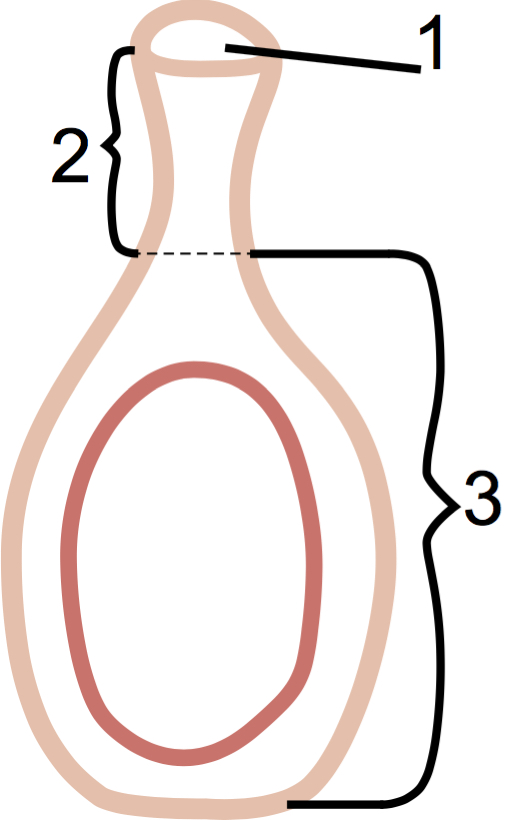
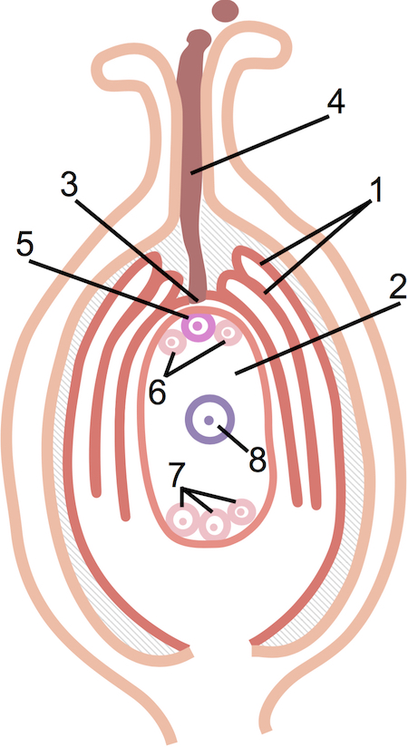

# Будова маточки та насінного зачатка

У маточці (сукупності плодолистків – гінецеї) розташований насінний зачаток. Маточка побудована із приймочки (1), стовпчика (2) та зав’язі (3). На приймочку потрапляє пилкове зерно, а у зав’язі розташований насінний зачаток.

Насінний зачаток складається з покривів (1) – інтегументів і
багатоклітинної частини – зародкового мішка (2). У насінному зачатку є невеликий отвір – пилковхід (3) або мікропіле, крізь який у нього потрапить пилкова трубка (4).

У насінному зачатку розташований зародковий мішок (жіночий гаметофіт), а в зародковому мішку – 7 клітин. З того боку, з якого знаходиться пилковхід, розташовані три гаплоїдні клітини (з одинарним набором хромосом). Одна з них – яйцеклітина (5), інші дві – синергіди (6). Ці три клітини: яйцеклітина та синергіди формують яйцевий апарат.

На протилежному полюсі також знаходяться три гаплоїдні клітини – антиподи (7). 

В центрі зародкового мішка знаходиться диплоїдна клітина – центральна клітина (8).

 
<quiz>
<question>

Установіть відповідність між складовими маточки під час подвійного запліднення та їхніми зображеннями на рисунку. 
Центральна клітина

<answer>А</answer>
<answer>Б</answer>
<answer correct>В</answer>
<answer>Г</answer>
<answer>Д</answer>
</question>
<question>

Спермії

<answer correct>А</answer>
<answer>Б</answer>
<answer>В</answer>
<answer>Г</answer>
<answer>Д</answer>
</question>
<question>

Вегетативна клітина

<answer>А</answer>
<answer>Б</answer>
<answer>В</answer>
<answer>Г</answer>
<answer correct>Д</answer>
</question>
<question>

Яйцеклітина

<answer>А</answer>
<answer correct>Б</answer>
<answer>В</answer>
<answer>Г</answer>
<answer>Д</answer>
</question>
<question>

Де розташований насінний зачаток у квіткових рослин?

<answer>на приймочці маточки</answer>
<answer>на пиляку тичинки</answer>
<answer correct>у зав’язі маточки</answer>
<answer>у квітколожі</answer>
<explanation>
На квітколожі розташовуються елементи квітки, на приймочку маточки потрапляє пилок, який формується у гнізді пиляка тичинки.
</explanation>
</question>
<question>

Вже сформований зародковий мішок містить:

<answer>5 клітин</answer>
<answer>6 клітин</answer>
<answer correct>7 клітин</answer>
<answer>8 клітин</answer>
<explanation>
Сформований зародковий мішок містить по три клітини на різних полюсах та одну центральну клітину.
</explanation>
</question>
</quiz>