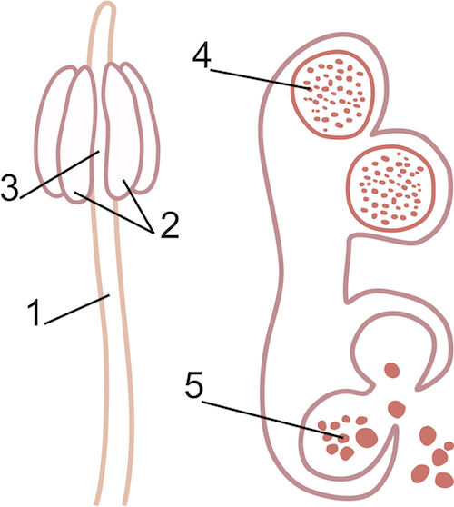

Будова тичинки та пилкового зерна
---------------------------------

Тичинка побудована з тичинкової нитки (№1 на малюнку A), на якій
розташований пиляк (№2). Дві половинки пиляка з’єднані
в’язальцем (№3). Праворуч зображено пиляк. Під №4 у гніздах
пиляка ще дозрівають пилкові зерна, а під №5 можна побачити, як уже висипається дозрілий пилок.

Одне пилкове зерно являє собою клітину, оточену двома оболонками.
Всередині пилкового зерна міститься велика вегетативна (тобто нестатева)
клітина, з якої утвориться пилкова трубка та дві статевих клітини
(гамети) – два спермії.

