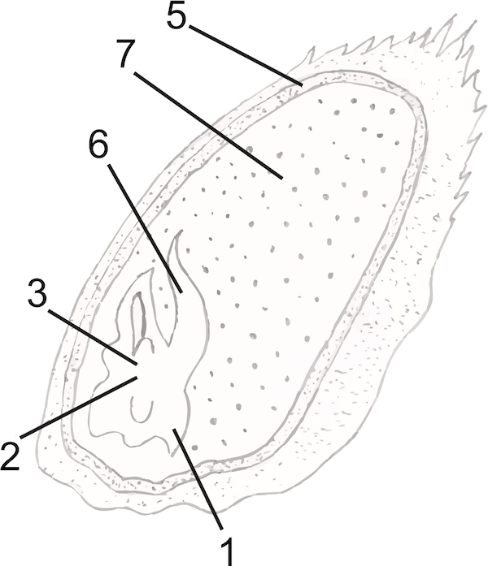

Насінина
========

Означення

<b>Насiнина</b> – це репродуктивний орган рослини, який утворюється з насiнного зачатка в результатi заплiднення.

У насінині є зародок. Він сформувався із зиготи. У зародку можна розрізнити зародковий корінець (№1), з якого згодом сформується головний корінь, зародкове стебельце (№2) та зародкову брунечку (№3). Насінина оточена шкіркою (№5), яка сформувалася з покривів – інтегументів. Також на насінині із зовнішнього боку помітний сім’явхід та рубчик (місце, в якому насінина відокремилася від насінної ніжки). У насінині з двома сім’ядолями ендосперм відсутній, а запасні речовини відкладаються в сім’ядолях – зародкових. Типовою дводольною рослиною є *квасоля*.

Типова однодольна рослина – це *пшениця*. В її насінині наявна єдина сім’ядоля – щиток (№6). Він відокремлює ендосперм (№7) від зародка.
Крізь щиток поживні речовини ендосперму просочуються до зародка. Шкірка зернівки (№5) зростається з оплоднем.

Зазвичай насіння проростає не одразу після відокремлення від рослини.
Спочатку насінина розвивається під час періоду спокою.

Означення

<b>Перiод спокою</b> – перiод, пiд час якого iнтенсивнiсть обмiну речовин у насiнинi знижується, а вмiст води не значний.

**Умови проростання насінини:**

-   Тепло (оптимальна температура)

-   Вода

-   Доступ повітря

<quiz>
<question>

Сім’ядоля – це

<answer>зародкова брунечка</answer>
<answer>зародковий корінець</answer>
<answer correct>зародковий листок</answer>
<answer>зародкове стебельце</answer>
</question>
<question>

В насінині квасолі поживні речовини містяться в:

<answer>ендоспермі</answer>
<answer>зародковому стебельці</answer>
<answer>зародковому корінці</answer>
<answer corret>сім’ядолях</answer>
<explanation>
Квасоля – дводольна рослина, поживні речовини містяться у зародкових листках – сім’ядолях.
</explanation>
</question>
<question>

Зародковий листок зернівки пшениці називається:

<answer correct>щиток</answer>
<answer>оплодень</answer>
<answer>шкірка</answer>
<answer>ендосперм</answer>
<explanation>
Пшениця – однодольна рослина, її єдина сім’ядоля (тобто зародковий листок) називається щиток.
</explanation>
</question>
</quiz>
