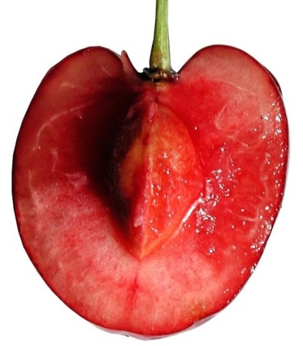
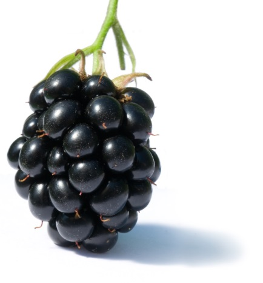
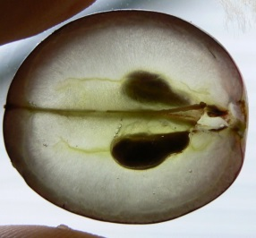
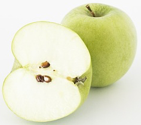
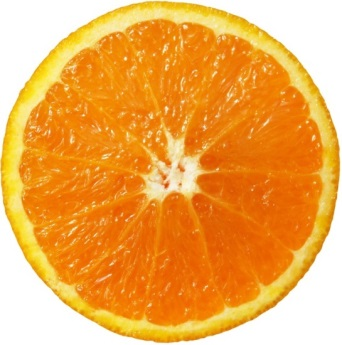
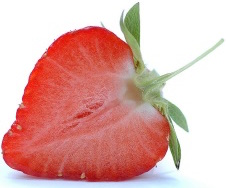
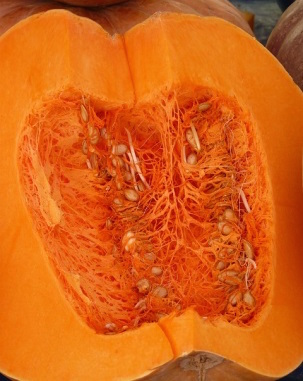

# Соковиті плоди

Означення

<b>Соковиті плоди</b> – плоди, оплодень яких містить 70-80% води.

<table>
<thead>
<tr>
<th>Плід</td>
<th>Характеристика</th>
<th>Представники</th>
<th>Зображення</th>
</tr>
</thead>
<tbody>
<td>Кістянка</td>
<td>Однонасінний; ендокарпій здерев’янілий, мезокарпій – соковитий, а екзокарпій  – тоненька шкірочка.</td>
<td>Вишня, глід, слива, кокосова пальма, персик</td>
<td></td>	
</tr>
<tr>
<td>Багатокістянка (складна кістянка, збірна кістянка)</td>
<td>Плід формується у квітках з великою кількістю маточок</td> <td>Малина, ожина</td>
<td></td>
</tr>
<tr>
<td>Ягода</td>
<td>Багатонасінний плід, у якого зовнішній шар шкірястий, а середній і внутрішній – соковиті.</td>
<td>Помідор, смородина, <b>картопля</b>, виноград, (банан)</td>
<td></td>
</tr>
<tr>
<td>Яблуко</td>
<td>Багатонасінний плід; наявні плівчасті камери з насінням, які формуються внаслідок розростання квітколожа.</td>
<td>Айва, яблуко, груша, горобина</td>
<td></td>
</tr>
<tr><td>Помаранча</td>
<td>Багатонасінний плід; зовнішній шар – шкірястий, багатий не ефірні олії, середній шар – білий та губчастий, сухий, а внутрішній – соковитий.</td>
<td>Апельсин, лимон, мандарин</td> 
<td></td>
</tr>
<tr>
<td>Суничина</td>
<td>Багатонасінний плід; утворюється в результаті розростання квітколожа.</td>
<td>Суниця, полуниця</td>
<td></td>
</tr>
<tr>
<td>Гарбузина</td>
<td>Зовнішній шар дерев’яніє, а середній і внутрішній залишаються соковитими та м’ясистими.</td>
<td>Гарбуз, арбуз, огірок, диня</td> 
<td></td>
</tr>
</tbody>
</table>

Означення

<b>Супліддя</b> – плід, який під час формування зростається з іншими плодами із суцвіття. Супліддя властиве буряку та ананасу, шовковиці.

