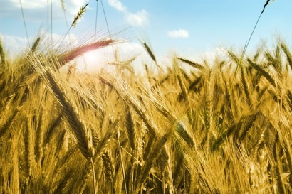
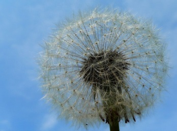
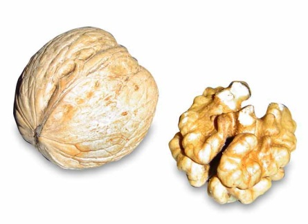
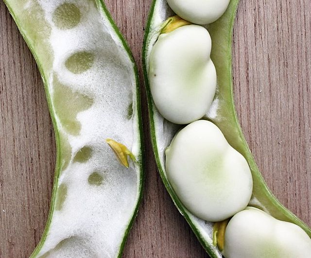
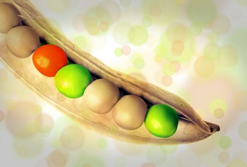
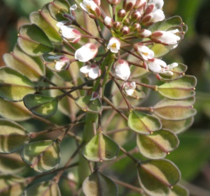
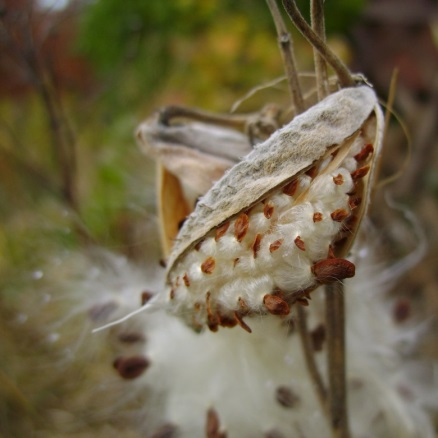
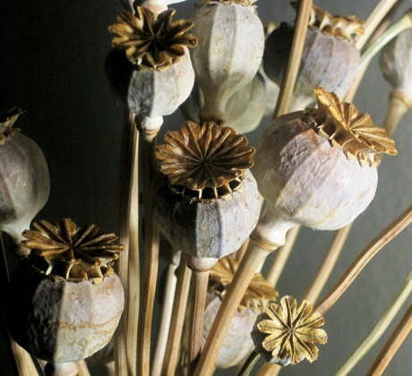

# Сухі плоди

Означення

<b>Сухі плоди</b> – це плоди, оплодень яких зазвичай здерев’янілий та містить незначну кількість води. Серед сухих плодів розрізняють нерозкривні однонасінні та розкривні багатонасінні.

##Сухі нерозкривні однонасінні плоди

<table>
<thead>
<tr>
<th>Плід</th>
<th>Характеристика</th>
<th>Представники</th>
<th>Зображення</th>
</tr>
</thead>
<tbody>
<tr>
<td>Зернівка</td>
<td>Оплодень та насінина зростаються</td>
<td>Жито, пшениця, ячмінь, кукурудза</td>
<td width="21%"></td>
</tr>
<tr>
<td>Сім’янка</td>
<td>Оплодень та насінина не зростаються</td>
<td>Соняшник, череда, кульбаба, жоржина</td>
<td></td>
</tr>
<tr>
<td>Горіх</td>
<td>Здерев’янілий оплодень, що не зростається з насіниною</td> <td>Гречка, ліщина, бук</td>
<td></td>
</tr>
</tbody>
</table>

##Сухі розкривні багатонасінні плоди

<table>
<thead>
<tr>
<th>Плід</th>
<th>Характеристика</th>
<th>Представники</th>
<th>Зображення</th>
</tr>
</thead>
<tbody>
<tr>
<td>Біб</td>
<td>Розкривається двома стулками, до яких прикріплюється насіння</td>
<td>Горох, квасоля, люпин, акація</td>
<td width="21%"></td>
</tr>
<tr>
<td>Стручок</td>
<td>Насіння кріпиться не до стулок, а до перегородки між ними</td>
<td>Капуста, гірчиця, редька</td>
<td></td>
</tr>
<tr>
<td>Стручечок</td>
<td>За будовою подібний до стручка, але значно коротший</td> <td>Талабан, грицики</td>
<td></td>
</tr>
<tr>
<td>Листянка</td>
<td>Розкривається лише по одному шву</td>
<td>Сокирки, магнолія, півонія</td>
<td></td>
</tr>
<tr>
<td>Коробочка</td>
<td>Розкривається по-різному: поздовжніми тріщинами, дірочками, кришечками тощо</td>
<td>Мак, блекота, дурман</td>
<td></td>
</tr>
</tbody>
</table>

<quiz>
<question>

До сухих розкривних плодів належить:

<answer>сім’янка</answer> 
<answer>зернівка</answer> 
<answer correct>коробочка</answer>
<answer>кістянка</answer>
<explanation>
Кістянка – соковитий плід, а зернівка та сім’янка – сухі нерозкривні плоди.
</explanation>
</question>
<question>

Виберіть групу рослин, які мають плід біб

<answer>горох, квасоля</answer>
<answer>капуста, гірчиця</answer>
<answer>грицики, рижій</answer>
<answer>ячмінь, жито</answer>
<explanation>
Капуста, гірчиця – плід стручок; грицики – коробочка, рижій – стручок; ячмінь, жито – зернівка.
</explanation>
</question>
<question>

Виберіть групу рослин, які мають плід сім’янка

<answer>талабан, грицики</answer>
<answer>сокирки, магнолія</answer>
<answer>гречка, бук</answer>
<answer correct>соняшник, кульбаба</answer>
<explanation>
Талабан, грицики – плід коробочка; сокирки, магнолія – плід листянка; гречка, бук – плід горіх.
</explanation>
</question>
</quiz>