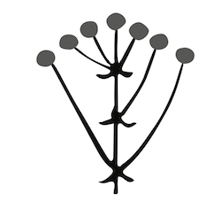
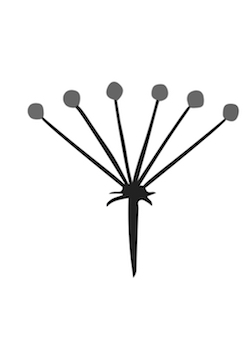
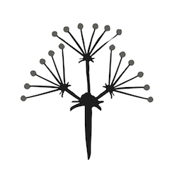

# Суцвіття

Визначення

<b>Суцвiття</b> — це сукупнiсть квiток, розташованих на однiй осi.

Розрізняють прості та складні суцвіття. *На простому суцвітті квітки розташовані на одній осі*.

*На складному суцвітті квітки розташовані не на головній осі, а головна вісь галузиться.*

Прості суцвіття
---------------

<table>
<thead>
<tr>
<th>Суцвiття</th>
<th>Характеристика</th>
<th>Представники</th>
<th>Зображення</th>
</tr>
</thead>
<tbody>
<tr>
<td>Китиця</td>
<td>Квiтки на квiтконiжках
однакової довжини розташованi на видовженiй осi</td>
<td>Черемха, смородина, iванчай, конвалiя</td>
<td width="20%"></td>
</tr>
<tr>
<td>Колос</td>
<td>Сидячi квiтки (без квiтконiжок) розташованi на видовженiй осi</td>
<td>Осока, подорожник, вербена</td>
<td></td>
</tr>
<tr>
<td>Щиток</td>
<td>На головнiй осi розташовано квiтки з квiтконiжками рiзної довжини</td>
<td>Груша, яблуня, глiд</td>
<td></td>
</tr>
<tr>
<td>Зонтик</td>
<td>На головнiй осi розташовано квiтки iз квiтконiжками однакової довжини</td>
<td>Вишня, цибуля, часник, первоцвiт весняний</td>
<td></td>
</tr>
<tr>
<td>Початок</td>
<td>На потовщенiй осi розташованi сидячi квiтки</td>
<td>Кала, аїр, кукурудза</td>
<td></td>
</tr>
<tr>
<td>Кошик</td>
<td>Квiтки без квiтконiжок розмiщенi на блюдцеподiбнiй осi</td>
<td>Соняшник, кульбаба, ромашка</td>
<td></td>
</tr>
<tr>
<td>Головка</td>
<td>Квiтки з короткими квiтконiжками розташованi на потовщенiй та вкороченiй осi</td>
<td>Конюшина</td>
<td></td>
</tr>
</tbody>
</table>

Складні суцвіття
----------------

<table>
<thead>
<tr>
<th>Суцвiття</th>
<th>Складові</th>
<th>Представники</th>
<th>Зображення</th>
</tr>
</thead>
<tbody>
<tr>
<td>Складний колос</td>
<td>Прості колоски</td>
<td>Злакові: пшениця, ячмінь, жито</td>
<td width="20%"></td>
</tr>
<tr>
<td>Волоть</td>
<td>Прості китиці</td>
<td>Бузок, овес, виноград, рис, просо</td>
<td></td>
</tr>
<tr>
<td>Складний зонтик</td>
<td>Прості зонтики</td>
<td>Петрушка, морква, кріп</td>
<td></td>
</tr>
<tr>
<td>Складний щиток</td>
<td>Прості щитки або кошики</td>
<td>Щитки – в горобини, кошики – в деревію</td>
<td></td>
</tr>
<tr>
<td>Сережка</td>
<td>На головній осі розташовані групи сидячих одностатевих квіток </td>
<td>Ліщина, береза</td>
<td></td>
</tr>
</tbody>
</table>

<quiz>
<question>

Правильна характеристика суцвіття китиця:

<answer>сидячі квітки (без квітконіжок) розташовані на видовженій осі</answer>
<answer correct>квітки на квітконіжках однакової довжини розташовані на видовженій осі</answer>
<answer>на головній осі розташовано квітки з квітконіжками різної довжини</answer>
<answer>квітки без квітконіжок розміщені на блюдцеподібній осі</answer>
<explanation>
Сидячі квітки (без квітконіжок) розташовані на видовженій осі – колос, на головній осі розташовано квітки з квітконіжками різної довжини – щиток, квітки без квітконіжок розміщені на блюдцеподібній осі – кошик.
</explanation>
</question>
<question>

Позначте групу рослин, у яких суцвіття - волоть.

<answer>подорожник, осока</answer>
<answer>пшениця, жито</answer>
<answer correct>овес, бузок</answer>
<answer>цибуля, часник</answer>
<explanation>
У подорожника й осоки суцвіття колос, в пшениці й жита – складний колос, а в цибулі та часнику – зонтик.
</explanation>
</question>
<question>

Позначте групу рослин, у яких суцвіття – складний зонтик:

<answer correct>морква, петрушка</answer>
<answer>жито, пшениця</answer>
<answer>яблуня, груша</answer>
<answer>черемха, смородина</answer>
<explanation>
Жито й пшениця мають суцвіття складний колос, яблуня та груша – щиток, черемха й смородина – китиця.
</explanation>
</question>
</quiz>