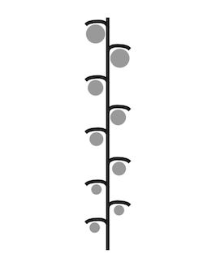

# Суцвіття

Означення

<b>Суцвiття</b> — це сукупнiсть квiток, розташованих на однiй осi.

Розрізняють прості та складні суцвіття. *На простому суцвітті квітки розташовані на одній осі*.

*На складному суцвітті квітки розташовані не на головній осі, а головна вісь галузиться.*

Прості суцвіття
---------------

<table>
<thead>
<tr>
<th>Суцвiття</th>
<th>Характеристика</th>
<th>Представники</th>
<th>Зображення</th>
</tr>
</thead>
<tbody>
<tr>
<td>Китиця</td>
<td>Квiтки на квiтконiжках
однакової довжини розташованi на видовженiй осi</td>
<td>Черемха, смородина, iванчай, конвалiя</td>
<td></td>
</tr>
<tr>
<td>Колос</td>
<td>Сидячi квiтки (без квiтконiжок) розташованi на видовженiй осi</td>
<td>Осока, подорожник, вербена</td>
<td></td>
</tr>
<tr>
<td>Щиток</td>
<td>На головнiй осi розташовано квiтки з квiтконiжками рiзної довжини</td>
<td>Груша, яблуня, глiд</td>
<td></td>
</tr>
<tr>
<td>Зонтик</td>
<td>На головнiй осi розташовано квiтки iз квiтконiжками однакової довжини</td>
<td>Вишня, цибуля, часник, первоцвiт весняний</td>
<td></td>
</tr>
<tr>
<td>Початок</td>
<td>На потовщенiй осi розташованi сидячi квiтки</td>
<td>Кала, аїр, кукурудза</td>
<td></td>
</tr>
<tr>
<td>Кошик</td>
<td>Квiтки без квiтконiжок розмiщенi на блюдцеподiбнiй осi</td>
<td>Соняшник, кульбаба, ромашка</td>
<td></td>
</tr>
<tr>
<td>Головка</td>
<td>Квiтки з короткими квiтконiжками розташованi на потовщенiй та вкороченiй осi</td>
<td>Конюшина</td>
<td></td>
</tr>
</tbody>
</table>

Складні суцвіття
----------------

<table>
<thead>
<tr>
<th>Суцвiття</th>
<th>Складові</th>
<th>Представники</th>
<th>Зображення</th>
</tr>
</thead>
<tbody>
<tr>
<td>Складний колос</td>
<td>Прості колоски</td>
<td>Злакові: пшениця, ячмінь, жито</td>
<td></td>
</tr>
<tr>
<td>Волоть</td>
<td>Прості китиці</td>
<td>Бузок, овес, виноград, рис, просо</td>
<td></td>
</tr>
<tr>
<td>Складний зонтик</td>
<td>Прості зонтики</td>
<td>Петрушка, морква, кріп</td>
<td></td>
</tr>
<tr>
<td>Складний щиток</td>
<td>Прості щитки або кошики</td>
<td>Щитки – в горобини, кошики – в деревію</td>
<td></td>
</tr>
<tr>
<td>Сережка</td>
<td>На головній осі розташовані групи сидячих одностатевих квіток </td>
<td>Ліщина, береза</td>
<td></td>
</tr>
</tbody>
</table>

