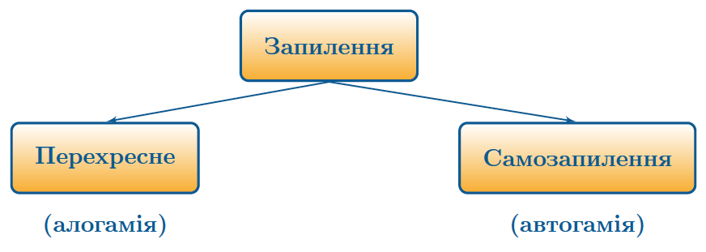

Запилення та запліднення
========================

Означення

<b>Запилення</b> — це процес перенесення пилку з тичинок на приймочку маточки.

Запилення може бути перехресним (алогамія), самозапиленням
(автогамія) та штучним. Під час перехресного запилення пилок з
тичинок однієї квітки потрапляє на іншу квітку. Під час самозапилення
пилок на іншу квітку не переноситься. Штучне запилення здійснюється
людиною.

До самозапильних рослин належать горох, квасоля, пшениця, овес, льон тощо.

При <b><u>перехресному</u></b> запиленні пилок може переноситися кількома шляхами:

-   Комахами (ентомофілія). Квітки таких рослин великі та яскраві, з
    сильним запахом, а пилок – липкий, з невеликими виростами. Таке
    запилення властиве більшості квіткових рослин.

-   Вітром (анемофілія). Вітрозапильні квіти мають невелику,
    безбарвну оцвітину. В них не утворюється нектар, однак утворюється
    велика кількість дрібного, гладенького пилку. До вітрозапильних
    рослин належать береза, ліщина, дуб, граб, бук тощо.

-   Водою (гідрофілія). У пиляках утворюється такий пилок, який не тоне.
    До водозапильних рослин належать кушир і стрілолист.

-   Тваринами (зоофілія). У таких рослин нектар не пахне, він рідкий.
