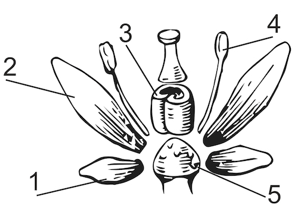

Зовнішня будова квітки
----------------------

Означення

<b>Квiтка</b> — це орган статевого розмноження, який являє собою видозмiнений i вкорочений пагiн.

Квітка складається з квітконіжки, квітколожа,
оцвітини, тичинок і маточки. Деякі із цих елементів
можуть бути відсутні.

Квітка кріпиться до пагона за допомогою квітконіжки – своєрідного
вкороченого стебла. Якщо квітконіжки немає, квітка називається сидячою.

Усі елементи квітки розташовані на квітколожі (№5 на малюнку).

У квітки наявна оцвітина (покрив квітки), яка складається з
чашечки – сукупності чашолистків (№1 на малюнку), та віночка
– сукупності пелюсток (№2 на малюнку).

Якщо чашечка й віночок однакові з формою та забарвленням, така оцвітина
називається простою, а якщо різні – складною або подвійною. Чашечка
(тобто сукупність чашолистків) захищає квітку, її внутрішні частини.
Чашечка може бути зрослолистою або роздільнолистою.

Пелюстки ж (тобто віночок) приваблюють комах для запилення. Оцвітина
може бути відсутня. Віночок може бути зрослопелюстковим або
роздільнопелюстковим.

У квітці наявна сукупність тичинок (№4 на малюнку) – андроцей У
них утворюються пилкові зерна. У квітці також наявний гінецей (№3
на малюнку) – це сукупність плодолистків. Плодолистки формують маточку,
у якій утворюється насінний зачаток.

Якщо через квітку можна провести кілька площин симетрії, вона
називається правильною або актиноморфною, якщо одну площину симетрії –
неправильною або зигоморфоною, а якщо жодної – асиметричною.

Класифікація квіток
-------------------

За наявністю тичинок і маточки квітки класифікують на
двостатеві, одностатеві та стерильні.

Означення

<b>Двостатева квiтка</b> — це квiтка, у якiй наявнi тичинки та маточка. Властивi
бiльшостi покритонасiнних рослин.

<b>Одностатева квiтка</b> — квiтка, у якiй наявнi або тичинки (тичинкова,
тобто чоловiча, квiтка), або маточка (маточкова, тобто жiноча, квiтка).

Якщо у квiтцi взагалi немає анi тичинок, анi маточки, вона називається <b>стерильною</b>.

Серед рослин із одностатевими квітками розрізняють однодомних і
дводомних. Якщо на одній рослині ростуть і тичинкові, і маточкові квіти,
вона називається однодомною (один дім). Такі квітки властиві березі,
дубу, огірку. Якщо тичинкові квітки розвиваються на одній особині, а
маточкові – на іншій, така рослина називається дводомною (два доми).
Такі квіти властиві тополі, обліписі, вербі, тощо.
