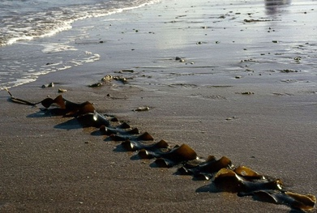
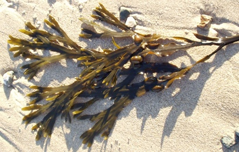
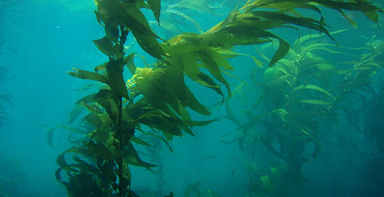
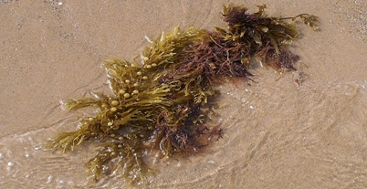

# Бурі водорості

**Загальна характеристика бурих водоростей:**

1.  Виключно багатоклітинні. Угрупування клітин починають
    нагадувати тканини. Клітини розташовуються двошарово: зовнішній шар – слизистий, клітинні стінки містять пектинові речовини, солі (альгінати), а клітини внутрішнього шару мають целюлозну клітинну стінку.

2.  Запасна речовина – **ламінарин**, а також відкладаються олії та йод;

3.  Буре забарвлення обумовлене пігментами: коричневими, жовтими
    та зеленими. Ці водорості поглинають світло на середніх глибинах – 20-30 м;

4.  Мешкають на середніх глибинах;

5.  Наявність органів прикріплення (ризоїди або підошви);

6.  Розмноження вегетативне (частинами талому), нестатеве (спорами, зооспорами, виводковими бруньками) та статеве (гаметами);

7.  Мешкають у морях.

Бурі водорості використовуються людиною у харчовій, хімічній та текстильній. промисловості, медицині, для добування йоду, брому, альгінатів.

## Різноманітність бурих водоростей: 

### Ламінарія (морська капуста)

Автор: Gabriele Kothe-Heinrich

На зображенні – цукриста ламінарія. Вона широко використовується в їжу, а її друга назва – морський салат (зелена ульва – це також морська капуста, але зелена). Клітини ламінарії містять багато йоду. Мешкає ця
водорість у морях Північної півкулі.

### Фукус

Автор: Stemonitis

У таломі фукусу наявні повітряні міхурі, які забезпечують вертикальне положення великого організму. Він також мешкає у північних морях.

### Макроцистіс

Надзвичайно велика водорість. Довжина талому може сягати 60 м, а маса – 150 кг. Макроцистіс мешкає у південних морях.

### Саргасум
На честь цього роду назвали море – Саргасове море.

