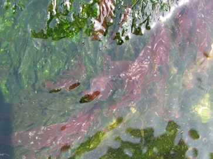

# Червоні водорості (Багрянки)

**Загальна характеристика червоних водоростей:**

-   Здебільшого багатоклітинні організми;

-   Запасна речовина – багрянковий крохмаль;

-   Клітинна стінка містить агар, який робить рослину слизькою на дотик. У деяких багрянок у клітинній стінці накопичуються мінеральні солі, завдяки яким рослини ніби кам’яніють;

-   Розмноження вегетативне (частинами слані), нестатеве (спорами) та статеве (гаметами);

-   Відсутні джгутикові стадії;

-   Наявність пігментів фікобілінів, завдяки яким ці водорості поглинають сині та фіолетові промені;

-   Мешкають на глибинах 200-250м.

Червоні водорості використовуються у харчовій промисловості та медицині, з них добувають агар.

<iframe align="center" width="560" height="315" src="https://www.youtube.com/embed/bg9-PoA2gpk" frameborder="0" allowfullscreen></iframe>

## Різноманітність червоних водоростей: 

### Порфіра (червоний морський салат)

Автор: Anonymous Powered

Схожа на платівки з хвилястими краями. Живе у північних і південних морях. Народна назва – червоний морський салат, адже порфіра вживається у їжу.

### Кораліна

Поширена в усіх морях, зокрема й у тропічних. Схожа на кущик. Талом кораліни просочений вапняком (СaCO$$_3$$). З кораліни виготовляють медичні препарати для лікування печії.

### Філофора

Автор: Thiotrix

Схожа на кущики. В Україні з неї добувають «чорноморський агар», який використовується у промисловості та мікробіології. З філофори також добувають йод.
