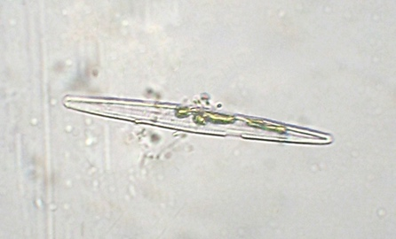
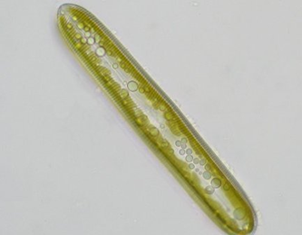

# Діатомові водорості

**Загальна характеристика:**

1.  Близько 20 тис. видів

2.  Одноклітинні або колоніальні;

3.  Радіальна(через організм можна провести багато осей симетрії) або двобічна симетрія(через організм можна провести лише одну вісь симетрії);

4.  Нестатеве розмноження (поділ клітини навпіл);

5.  Наявність панцира з кремнезему (SiO$$_2$$). Панцир складається з двох половинок, одна з яких накриває іншу. В ньому наявні пори, через які здійснюється зв’язок з навколишнім середовищем. У двобічносиметричних діатомових водоростей наявний шов, завдяки якому вони можуть ковзати, а в радіально-симетричних шва немає, тому вони не рухаються.

6.  Замість крохмалю утворюються краплі олії, завдяки яким організми утримуються у товщі води;

7.  Утворюють поклади діатоміту, доломіту та трепелу. Використовуються людиною для шліфування металів, виготовлення фільтрів і як матеріали для звукоізоляційних матеріалів. Діатомові водорості часто є індикаторами забруднення води.

## Рiзноманiтнiсть дiатомових водоростей
### Навiкула

Автор: Minami Himemiya

### Пінулярія

Автор: Minami Himemiya

Ці водорості двобічносиметричні, та є бентосними організмами, тобто мешкають на дні водойм.

<iframe align="center" width="560" height="315" src="https://www.youtube.com/embed/ssRo2_ROvU4" frameborder="0" allowfullscreen></iframe>

<quiz>
<question>

Співвіднесіть водорість та особливість її будови: 
навікула

<answer>багатоклітинна водорість</answer>
<answer correct>одноклітинна водорість</answer>
<answer>колоніальна водорість</answer>
</question>
<question>

спірогира

<answer correct>багатоклітинна водорість</answer>
<answer>одноклітинна водорість</answer>
<answer>колоніальна водорість</answer>
</question>
<question>

вольвокс

<answer>багатоклітинна водорість</answer>
<answer>одноклітинна водорість</answer>
<answer correct>колоніальна водорість</answer>
</question>
<question>

Речовина, яку містить панцир діатомових водоростей

<answer>ламінарин</answer>
<answer>целюлоза</answer>
<answer correct>кремнезем</answer>
<answer>багрянковий крохмаль</answer>
<explanation>Черепашка діатомових водоростей просочена кремнеземом, а через пори відбувається обмін речовин водорості з навколишнім середовищем.</explanation>
</question>
</quiz>
