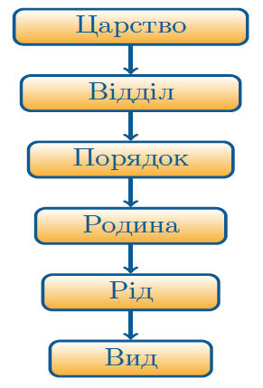

# Різноманітність рослин. Водорості(нижчі) та вищі сопорові рослини

## Систематика рослин

Означення

<b>Систематика</b> – наука, яка вивчає рiзноманiття органiзмiв та класифiкує їх.

<b>Таксон</b> – група або групи органiзмiв, якi об’єднуються у певну одиницю класифiкацiї.

Залежно від наявності тканин, рослини поділяють на нижчі та вищі. У
нижчих рослин – водоростей – тканин немає, у вищих рослин вже
з’являються тканини і відбувається розчленування на органи.

<b>Порядок таксонів у ботаніці</b>

