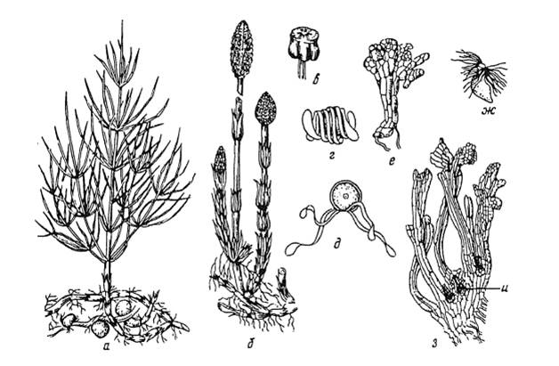

# Відділ Хвощеподібні

**Загальна характеристика:**

-   Члениста будова тіла;

-   Стебло, просякнуте кремнеземом;

-   Переважання спорофіту над гаметофітом;

-   Усі сучасні хвощі – трав’янисті рослини;

-   Формування покладів кам’яного вугілля;

-   Злісні бур’яни;

-   Хвощ польовий – індикатор кислих ґрунтів.

**Особливості будови та процесів життєдіяльності хвоща польового:**

Джерело зображення – «Ботаника» Андреева И.И., Родман Л.С.

Літерою «б» позначено бурий спороносний пагін, який з’являється навесні та основна його функція – розмноження. На верхівці цього пагона розташований спороносний колосок. На зображенні позначено щиток зі спорангіями (в), які містять такі спори (г, д). Після дозрівання оболонки спор розриваються на стрічкоподібні елатери – пружинки, які утримують спори групами.

Зі спор формуються гаметофіти. Чоловічий гаметофіт позначено літерою «е», а поряд – жіночий (з). Чоловічу гамету – сперматозоїд – позначено літерою «ж». Після запліднення (злиття сперматозоїда з яйцеклітиною) із зиготи розвивається спорофіт.

Після спороношення весняні пагони відмирають, а формуються літні зелені фотосинтезуючі пагони. Їх також називають вегетативними.

На кореневищах хвощів формуються бульби – видозмінені пагони, у яких відкладається крохмаль. Існує припущення, що ці бульби колись використовувалися в їжу.

<iframe align="center" width="560" height="315" src="https://www.youtube.com/embed/f8R1WMR7LlM" frameborder="0" allowfullscreen></iframe>

 
<quiz>
<question>

Підземна частина хвощеподібних – це:

<answer>корінь</answer>
<answer>коренеплід</answer>
<answer correct>кореневище</answer>
<answer>членисте стебло</answer>
<explanation>Підземна частина хвоща представлена кореневищем, на якому можуть утворюватися бульби.</explanation>
</question>

<question>

Основна функція весняних пагонів хвоща польового –

<answer correct>спороношення</answer>
<answer>фотосинтез</answer>
<answer>накопичення поживних речовин</answer>
<answer>закріплення рослини в ґрунті</answer>
<explanation>Весняні пагони хвоща польового бурі та спороносні, а літні – зелені та фотосинтезуючі.</explanation>
</question>
</quiz>
