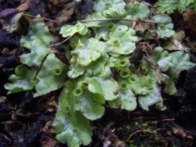

# Відділ Мохоподібні

**Загальна характеристика:**

1.  Будова: таломні пластинчасті, листкостеблові рослини.

2.  Наявність ризоїдів; 
    Ризоїди – коренеподібні вирости покривних тканин стебла.

3.  Наявність покривних та основних тканин;

4.  Переважання гаметофіту над спорофітом. Спорофіт напівпаразитує на гаметофіті.

5.  Основа рослинного покриву боліт і річок, формування покладів торфу.

## Найтиповіші представники:

### Зозулин льон (рунянка, полiтрих звичайний)

Джерело зображення – www.wikipedia.org

Цей мох має листкостеблову будову та є дводомною рослиною – на одній рослині розташовані архегонії (жіночі статеві органи), а на іншій – антеридії (чоловічі статеві органи). Коли сперматозоїди з антеридію потрапляють на архегоній, вони зливаються з яйцеклітиною та відбувається запліднення. В результаті формується зигота, з якої розвивається зародок – спорофіт. Він паразитує на гаметофіті, а не існує окремо. Ось чому в життєвому циклі мохів переважає гаметофіт.
    
Спорофіт представлений коробочкою на ніжці. Коробочка прикрита ковпачком і має зубчики, які слугують для розсіювання спор. За сприятливих умов спора проростає та формується протонема, яка нагадує зелену нитчасту водорість. Протонема галузиться, на ній утворюються бруньки, з яких розвиваються або чоловічі, або жіночі гаметофіти.

### Маршанція мінлива

Цей мох має пластинчасту (таломну) будову.

Джерело зображення – www.wikipedia.org

### Сфагнум

Джерело зображення – www.wikipedia.org

Сфагнові мохи мають листкостеблову будову. Їх листки складаються з двох типів клітин – фотосинтезуючих і тих, що запасають воду. Сфагнум – однодомна рослина, архегонії та антеридії розвиваються на одній і тій самій особині. Сфагнові мохи поширені на болотах, наростають верхівкою, а нижня частина стебла поступово відмирає, однак, занурена у воду, вона не перегниває. Клітини сфагнових мохів виділяють кислоти, які вбивають мікроорганізми і таким чином перешкоджають процесам гниття.

Зверніть увагу, зі сфагнових мохів формуються поклади  торфу.

<iframe align="center" width="560" height="315" src="https://www.youtube.com/embed/CDz2biuFETI" frameborder="0" allowfullscreen></iframe>

