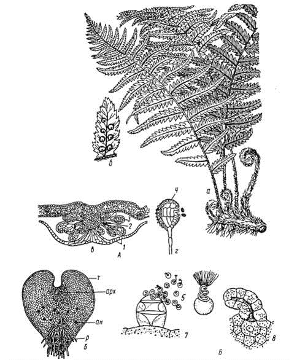

# Відділ Папоротеподібні

**Загальна характеристика:**

1.  Видозмінене стебло – кореневище;

2.  Великі перисті листки – вайї;

3.  Скупчення спорангіїв на нижньому боці листка – соруси;

4.  Переважання спорофіту над гаметофітом;

5.  Формування покладів кам’яного вугілля;

До Червоної книги України віднесено: марсилію чотирилисту, вудію альпійську, сальвінію плаваючу, адіантум венерин волос.

**Особливості будови та процесів життєдіяльності щитника чоловічого:**

Джерело зображення – «Ботаника» Андреева И.И., Родман Л.С.

На малюнку позначено спорофіт (а) з великими листками – вайями. А також сорус на нижньому боці вайї (б), кулясті утворення – це спорангії. Соруси вкриті покривальцем – індузієм.

Під літерою «г» познаечно окремий спорангій, з якого висипаються спори. Після потрапляння спори в ґрунт, з неї розвивається гаметофіт – заросток. Він зображений у нижній частині малюнка ліворуч. В нього наявні ризоїди, які закріплюють заросток у ґрунті. На гаметофіті функціонують зверху архегонії, а внизу – антеридії. Після злиття гамет (запліднення), із зиготи формується новий спорофіт.

<iframe align="center" width="560" height="315" src="https://www.youtube.com/embed/kCVCAg3qbSc" frameborder="0" allowfullscreen></iframe>

 

<quiz>
<question>

Вирости, які позначено на рисунку буквою Х, призначені для

<answer correct>закріплення рослини в ґрунті</answer>
<answer>здійснення фотосинтезу</answer>
<answer>статевого розмноження</answer>
<answer>відкладання поживних речовин</answer>
<explanation>Зображено гаметофіт папороті, який закріплюється позначеними на малюнку ризоїдами в ґрунті.</explanation>
</question>
<question>

Група спорангіїв на нижньому боці вайї називається:

<answer>стробіл</answer>
<answer>індузій</answer>
<answer correct>сорус</answer>
<answer>спороносний колосок</answer>
<explanation>Стробіл – це зібрання спорангіїв у плауна, індузій – покривальце, яке вкриває сорус, а спороносний колосок – сукупність спорангіїв у хвоща.</explanation>
</question>
</quiz>
