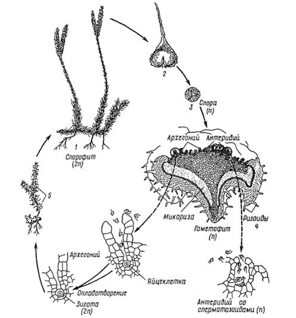

# Відділ Плауноподібні

**Загальна характеристика:**

-   Листкостеблова будова;

-   Поява вегетативних органів: кореня та пагона;

-   Переважання спорофіту над гаметофітом;

-   Усі сучасні плауни – трав’янисті рослини;

-   Формування покладів кам’яного вугілля;

-   Використання у піротехніці, медицині (дитяча присипка «Лікоподій»), ветеринарії, задля боротьби з комахами, які паразитують на домашніх тваринах.

Назва «плаун» виникла завдяки плавучим спорам, що містять до 50% олії. Їх оболонки розриваються з тріском.

На території України мешкає кілька видів плауноподібних, найвідоміші: плаун булаво видний, молодильник озерний, лікоподієла, селагінела, баранець звичайний тощо.

**Особливості будови та процесів життєдіяльності плауна булавовидного.**

Джерело зображення – «Ботаника» Андреева И.И., Родман Л.С.

Під №1 зображено спорофіт плауна булавовидного: стебло з маленькими листочками, а на верхівці – стробіли – зібрання спорангіїв (№2) у плаунів. Спора (№3) потрапляє в ґрунт і проростає приблизно через три роки, коли вступить у співжиття з грибом.

Зі спори виростає гаметофіт – заросток, на якому наявні архегонії та антеридії. В гаметофіту також є ризоїди, які закріплюють рослину в ґрунті. Із заплідненої яйцеклітини розвивається новий спорофіт.

<iframe align="center" width="560" height="315" src="https://www.youtube.com/embed/4aWqpViMA5Q" frameborder="0" allowfullscreen></iframe>

 
<quiz>
<question>

Сукупність спорангіїв на спорофіті плауна булавовидного – це:

<answer>макроспорангій</answer>
<answer>спороносний колосок</answer>
<answer correct>стробіл</answer> 
<answer>сорус</answer>
<explanation>Спороносний колосок – це сукупність спорангіїв у хвощеподібних, а сорус – у папоротеподібних.</explanation>
</question>

<question>

Спори яких рослин використовують для виготовлення дитячої присипки

<answer correct>плауноподібних</answer> 
<answer>хвощеподібних</answer>
<answer>мохоподібних</answer>
<answer>папоротеподібних</answer>
</question>
</quiz>
