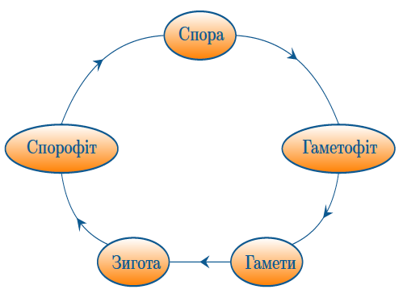

# Вищі спорові рослини

Визначення

<b>Вищi споровi рослини</b> — рослини, якi мешкають у наземному середовищi та розмножуються спорами.

**Характерні риси:**

-   Наявність тканин;

-   Наявність органів;

-   Наявність багатоклітинних органів розмноження;

-   Індивідуальний розвиток починається із зародка;

-   Чергування статевого та нестатевого поколінь;

-   Залежність запліднення від води.

Визначення

<b>Життєвий цикл</b> <i>у вищих спорових рослин</i> — це сукупнiсть статевого й нестатевого поколiнь.

<b>Спорофiт</b> — це нестатеве поколiння.

На ньому наявні багатоклітинні органи нестатевого розмноження – спорангії. У спорангіях формуються спори з гаплоїдним (тобто одинарним) набором хромосом.

Визначення

<b>Гаметофiт</b> – статеве поколiння, особина, в якої наявнi багатоклiтиннi органи статевого розмноження: архегонiї (жiночi органи статевого розмноження) та антеридiї (чоловiчi органи статевого розмноження).

У навколишньому середовищі зі спори розвивається гаметофіт. В архегоніях формуються жіночі гамети – яйцеклітини, а в антеридіях – чоловічі гамети – сперматозоїди. Коли ці дві гамети зливаються, утворюється зигота, з якої розвивається зародок – майбутній спорофіт.

<iframe align="center" width="560" height="315" src="https://www.youtube.com/embed/MHIFYGV4cxQ" frameborder="0" allowfullscreen></iframe>

 
<quiz>
<question>

Спорофіт формується з(зі):

<answer>спори</answer>
<answer>гаметофіту</answer>
<answer correct>зиготи</answer>
<answer>гамети</answer>
<explanation>Спорофіт – це особина нестатевого покоління, вона формується із зиготи, а зигота утворюється внаслідок злиття гамет. Гамети формуються на гаметофіті, який, у свою чергу, розвивається зі спори. Спори формуються на спорофіті.</explanation>
</question>

<question>

Характерною рисою вищих спорових рослин є:

<answer>наявність одноклітинних органів розмноження</answer>
<answer>відсутність тканин і органів</answer>
<answer correct>залежність запліднення від води</answer>
<answer>відсутність чергування поколінь</answer>
<explanation>У вищих спорових рослин наявні багатоклітинні органи розмноження, тканини та органи, складний життєвий цикл із чергуванням поколінь.</explanation>
</question>
<question>

Гаметофіт – це

<answer>органи статевого розмноження</answer> 
<answer>нестатеве покоління</answer>
<answer correct>рослина з органами статевого розмноження</answer>
<answer>спорангій</answer>
<explanation>Гаметофіт – це статеве покоління, тобто особина з органами статевого розмноження.</explanation>
</question>
</quiz>
