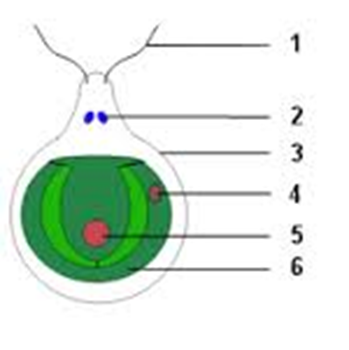
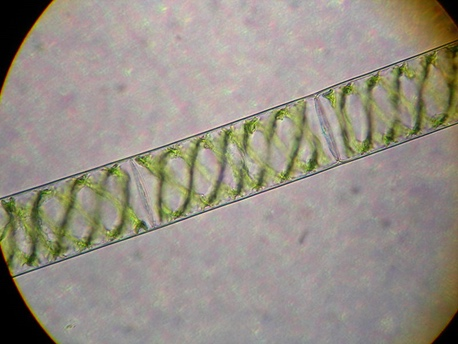
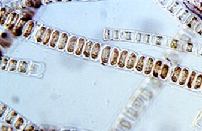
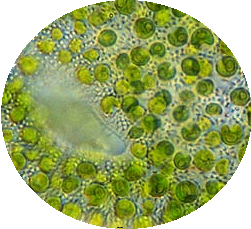
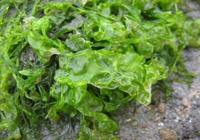
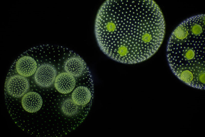

# Зелені водорості

**Загальна характеристика зелених водоростей:**

-   Близько 20 тис. видів;

-   Велика кількість хлорофілу;

-   Одноклітинні, багатоклітинні, колоніальні.

-   Запасна речовина – крохмаль.

-   Різні середовища мешкання;

-   Належать до <u>планктону</u>.

<iframe align="center" width="560" height="315" src="https://www.youtube.com/embed/RWjCZzaBRlI" frameborder="0" allowfullscreen></iframe>

##Різноманітність зелених водоростей

### Хламiдомонада
Одноклітинні прісноводна водорість, планктон.

Автор: Sundance Raphael

Клітина хламідомонади оточена пектиново-целюлозною оболонкою (№3). Всередині клітини наявне одне ядро (№5) та великий чашоподібний
хлоропласт (№6). Під №4 можна побачити світлочутливе вічко – стигму, воно орієнтує водорість у просторі. Переміщується клітина завдяки джгутикам (№1), в основі яких розташовані дві скоротливі вакуолі (№2), які видаляють надлишок води. На малюнку не позначено піреноїд – білкове утворення, навколо якого накопичуються поживні речовини, зазвичай крохмаль. За сприятливих умов хламідомонада розмножується нестатево, зооспорами. За несприятливих умов хламідомонада розмножується статево – гаметами. Масове розмноження може викликати «цвітіння» води.

### Спірогира

Багатоклітинна нитчаста водорість. Всередині клітини підвішене ядро, від якого відходять цитоплазматичні тяжі. Хлоропласти спіралеподібні. Прозора частина – це вакуоля з клітинним соком. Водорість може розмножуватися нестатево (частинами ниток, спорами) або статево (гаметами). Спірогира, як і хламідомонада, прісноводна водорість. Вона мешкає у стоячих водоймах, у товщі води. Часто нитками спірогири живляться риби.

### Улотрикс

Автор: T.Voekler

Багатоклітинна нитчаста прісноводна водорість. Вона прикріплюється до дна водойм ризоїдами – коренеподібними виростами. Може розмножуватися вегетативно та є кормом для багатьох риб.

### Хлорела

Автор: VladiDamian

Одноклітинна водорість, яка мешкає і в солоних, і прісних водоймах, а також у ґрунті. У хлорели відсутні вічко та джгутики, а розмножується вона виключно нестатево. Ця водорість використовується у харчовій промисловості, з нею проводили досліди в космосі та вважали її «їжею майбутнього», однак незабаром виявилося, що вона виділяє токсичні речовини.

### Ульва (зелений морський салат)

Автор: Kristian Peters

Багатоклітинна водорість, яка мешкає у морській воді. Вона вважається найбільшою зеленою водорістю. У багатьох країнах ульва вживається у їжу.

### Вольвокс

Автор: Frank Fox

Колоніальний організм (складається з багатьох клітин, подібних за формою і будовою, з’єднаних цитоплазматичними містками).
