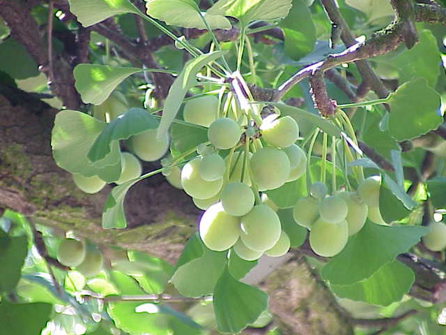

# Різноманітність Голонасінних

До відділу Голонасінні належать шість класів.

## Родина Саговникові
Ці Голонасінні рослини схожі на пальми та тривалий час ботаніки відносили саговники до пальм. Вони мають єдину нерозгалужену жилку, ростуть у тропіках.

Автор: Esculapio

## Родина Гінкгові
Родина гінгкові налічує лише один вид – гінкго дволопатеве. Ця рослина є реліктом.

Означення

<b>Релiкт</b> – це давня рослина, яка була поширена в попереднi геологiчнi епохи, i збереглася до наших днiв.

Зараз гінкго вважається священною рослиною в Японії та Китаї. В перекладі з японської, «гінкго» – це срібний абрикос.

Автор: Kurt Stüber

