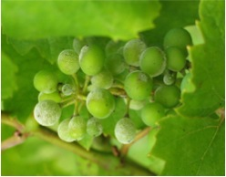

# Гриби-паразити

<ul>
<li><b>Сажкові гриби</b> зазвичай паразитують на злакових. При цьому та частина рослини в якій паразитує гриб виглядає, ніби обвуглена. Сажкові гриби спричиняють зниження урожайності злаків, а хліб, виготовлений з хворих рослин, отруйний і неприємно пахне.</li>

<li><b>Іржасті гриби</b> спричиняють появу на уражених органах рослин нальоту, схожого на іржу. Клавіцепс пурпуровий — іржастий гриб — викликає захворювання ріжки, коли замість зернівок у колоску жита утворюються ріжки, як на фотографії. Ріжки, які потрапили до борошна, з якого випекли хліб, можуть викликати важкі отруєння та захворювання «антонів вогонь» (тобто гангрена) в людини.</li>

<li><b>Борошнисторосяні</b> гриби спричиняють захворювання борошниста роса в  різних рослин. Ознакою борошнистої роси є поява на уражених органах рослин плям, схожих на борошно.</li>

<li><b>Трутовики</b> — паразити дерев. Вони потрапляють всередину рослини через корені або пошкодження на корі та розростаються. Через деякий час на корі з’являються плодові тіла цих грибів. Трутовики спричиняють трухлявіння дерева та його руйнування.</li>

</ul>

<quiz>
<question>

Які гриби завдають шкоди цінним породам дерев?

<answer>маслюки</answer>
<answer>сажки</answer>
<answer correct>трутовики</answer>
<answer>опеньки</answer>
<explanation>Трутовики спричиняють трухлявіння дерев.</explanation>
</question>
<question>

Паразитичний спосіб живлення властивий:

<answer>пеніцилу</answer>
<answer>мухомору</answer>
<answer correct>ріжкам</answer>
<answer>мукору</answer>
<explanation>Мукор і пеніцил – сапротроф, а мухомор – симбіотроф, він утворює мікоризу з багатьма хвойними деревами.</explanation>
</question>
</quiz>
