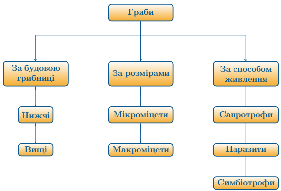

#Гриби
##Загальна характеристика грибів

<ul>
<li>Одноклітинні, багатоклітинні, колоніальні організми (колоніальний гриб — дріжджі);</li>
<li>Необмежений ріст, прикріплений спосіб життя, клітинна стінка з хітину — властивості рослин, характерні для грибів. Однак у рослин клітинна стінка просочена целюлозою, а у грибів хітином.</li>
<li>Гетеротрофний спосіб живлення, запасна речовина — глікоген, сечовина в обміні речовин — властивості тварин, характерні для грибів.</li>
<li>Вегетативне тіло гриба — міцелій (грибниця), який складається з тонких і розгалужених ниток — гіфів.</li>
<li>Розмноження: вегетативне (частинами грибниці), нестатеве (спорами), статеве.</li>
<li>Усі середовища існування.</li>
</ul>

Означення

<b>Мікологія</b> — наука про гриби.

<u><i>За будовою грибниці</i></u> гриби класифікують на нижчі та вищі. Якщо у гіфах немає перетинок, весь міцелій нагадує розгалужену клітину. Гриби з таким міцелієм називають нижчими, а міцелій  інколи неклітинним, несептованим.

Якщо у гіфах наявні перетинки, як між клітинами, такий міцелій називають септованим або клітинним, а гриб — вищим.

<u><i>За розмірами</i></u> розрізняють мікроміцети та макроміцети. Відповідно мікроміцети — це мікроскопічні організми. Макроміцети — це гриби, в яких утворюється плодове тіло, побудоване із щільно переплетених гіфів. Плодове тіло має вигляд шапки й ніжки.

<u><i>За способом живлення</i></u> розрізняють сапротрофи, які живляться рештками відмерлих організмів, паразити, які живуть і живляться за рахунок іншого організму, та симбіотрофи, які не завдають шкоди, а інколи й приносять користь організму, з яким співіснують.

<quiz>
<question>

Грибам властивий тип живлення:

<answer>Автотрофний</answer>
<answer>Міксотрофний</answer>
<answer correct>Гетеротрофний</answer>
<answer>Сапрофітний</answer>
<explanation>Гриби не є автотрофами або мікотрофами, але сапрофітний – це різновид гетеротрофного живлення.</explanation>
</question>
<question>

Виберіть ознаки грибів 
Тіло називається

<answer correct>міцелій</answer>
<answer>мікориза</answer>
<answer>слань</answer>
<question>

Вегетативне тіло утворене

<answer>клітинами, що утворюють нитки</answer>
<answer correct>щільним сплетенням гіф</answer>
<answer>шапкою і ніжкою</answer>
<question>

Тип живлення

<answer>хемотрофи</answer>
<answer>автотрофи</answer>
<answer correct>гетеротрофи</answer>
</question>
<question>
</quiz>
