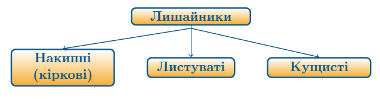

# Лишайники

##Загальна характеристика лишайників

<ul>
<li>Співжиття гриба й водорості.</li>
<li>Таломна будова: гіфи гриба переплітаються та утворюють верхню й нижню кірку. Верхня кірка товстіша за нижню, буває різних кольорів і забезпечує поглинання води й мінеральних речовин із повітря, захист лишайнику. Нижня кірка утворює вирости, що закріплюють організм на субстраті. Між гіфами гриба розташовується водорість (зазвичай зелена або ціанобактерія), яка фотосинтезує та постачає гриб органічними речовинами.</li>
<li>Виділення кислот, які розчиняють мінеральні речовини довкілля. Таким чином лишайники сприяють вивітрюванню гірських пород та утворенню ґрунту, тому їх часто називають — «Піонери рослинності», адже з появою ґрунту місцевість заселяють рослини.</li>
<li>Здатність швидко висихати та довго знаходитися в такому стані. При невеликому зволоженні процеси життєдіяльності знову відновлюються.</li>
<li>Повітряне живлення.</li>
<li>Розмноження здебільшого вегетативне.</li>
</ul>

Означення

<b>Ліхенологія</b> — наука, яка вивчає лишайники.

За формою слані (талому) розрізняють три види лишайників:

<ul>
<li><b>Накипні (або кіркові)</b> мають вигляд кірки. До кіркових лишайників належить <i>графіс</i>.</li>
<li><b>Листуваті лишайники</b>, наприклад, <i>цетрарія</i>, <i>пармелія</i> та <i>ксанторія</i>. Мають вигляд листоподібної пластинки.</li>
<li><b>Кущисті лишайники</b> схожі на невеличкі кущики. До кущистих лишайників належать <i>уснея</i> та <i>ягель</i>, який також називається кладонія, а в народі — «оленячий мох», яким живляться північні олені.</li>
</ul>