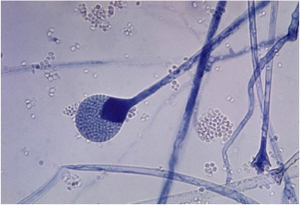
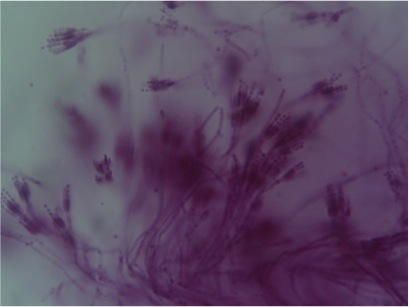
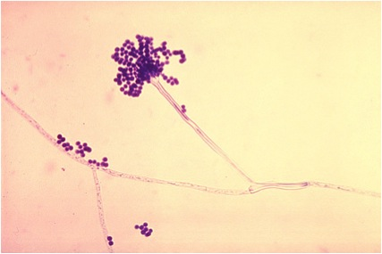

# Цвілеві гриби

Визначення

<b>Цвілеві гриби</b> — це здебільшого мікроскопічні організми, які утворюють нальот — плісняву.

<ul>
<li><b>Мукор</b> 

Нижчий гриб. Його міцелій виглядає, як багатоядерна суцільна клітина без перегородок. Пліснява на харчових продуктах — це зазвичай мукор. На фотографії можна побачити спорангієносець зі спорангієм, всередині якого формуються спори. Однак мукор може розмножуватися статево за несприятливих умов. У такому разі утворюється зигоспора. Мукор належить до сапрофітів.

</li>
</ul>

<ul>
<li><b>Пеніцил</b> 

Гриб-сапрофіт. Міцелій пеніцила багатоклітинний. При нестатевому розмноженні у конідієносцях, зображених на фото, утворюються спори — конідії. Статеве розмноження відбувається дуже рідко. Пеніцил виділяє речовини, які вбивають бактерії. Цю властивість гриба відкрив у 1928р. А.Флемінг. Саме з пеніцилу було зроблено перший антибіотик. Пеніцил також використовують для виготовленні французьких сирів, які мають специфічний запах. «Брі», «Рокфор», «Камамбер» — усі вони містять пеніцил.

</li>
</ul>

<ul>
<li><b>Аспергіл</b> 

Має багатоклітинну грибницю та є сапротрофом. Однак, якщо в пеніцила гіфи утворювали конідієносці, схожі на китиці, то в аспергіла органи нестатевого розмноження схожі на головки. Аспергіл використовується у мікробіології, а на Сході — для виготовлення соєвого соусу та соєвого тіста.

</li>
</ul>

<quiz>
<question>

Формування конідієносців властиве:

<answer>ріжкам</answer>
<answer>мукору</answer>
<answer correct>пеніцилу</answer>
<answer>трутовикам</answer>
</question>
<question>

Антибіотики можна отримати з клітин:

<answer>дріждів</answer>
<answer>іржастих грибів</answer>
<answer correct>пеніцилу</answer>
<answer>білого гриба</answer>
<explanation>Пеніцил – цвілевий гриб, а цвілеві гриби виділяють речовини, які мають бактерицидну дію.</explanation>
</quiz>
